<div align="center">

<picture>
  <source media="(prefers-color-scheme: dark)" srcset="docs/brand/logo-dark.svg">
  
</picture>

### Find what broke. Fix it safely.

An open-source incident response workspace. The AI gathers the evidence and suggests a fix **with proof**; a second person approves it; every step is on the record.

[**Try the live demo**](https://ai-incident-commander-app.vercel.app/#demo) · [**Watch the 2 minute video**](https://ai-incident-commander-app.vercel.app/#video) · [Live site](https://ai-incident-commander-app.vercel.app) · [Run it locally](#run-it-locally) · [Docs](#documentation)

-6366f1)


<a href="https://ai-incident-commander-app.vercel.app/#video">
  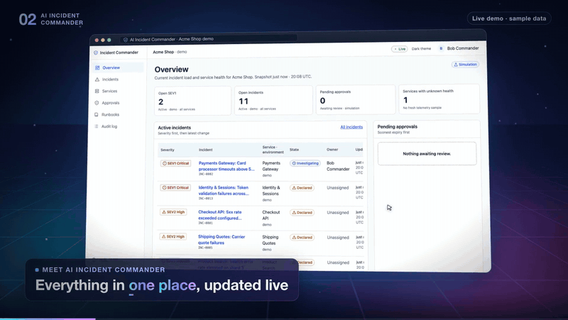
</a>

<sub>Click the preview to watch the full video with sound, or download <a href="media/explainer/ai-incident-commander-explainer.mp4">the MP4</a> (2:19, 1080p, subtitles included).</sub>

</div>

---

## Try the live demo

Open **[the live demo](https://ai-incident-commander-app.vercel.app/#demo)** and sign in as any of the sample people. It is the real dashboard, running entirely in your browser on sample data, so nothing you do is sent anywhere and you can reset it at any time.

| Sign in as | Role | Try this |
| --- | --- | --- |
| [Bob](https://ai-incident-commander-app.vercel.app/demo/login/?as=00000000-0000-4000-8000-000000000002) | Commander and responder | Acknowledge the checkout incident, request the AI suggested rollback, then try to approve it yourself |
| [Carol](https://ai-incident-commander-app.vercel.app/demo/login/?as=00000000-0000-4000-8000-000000000003) | Commander | Approve Bob's request and watch it run; the Payments request shows an uncertain result being reconciled |
| [Alice](https://ai-incident-commander-app.vercel.app/demo/login/?as=00000000-0000-4000-8000-000000000001) | Responder | Acknowledge, comment and request a diagnosis; approvals and audit are off limits |
| [Erin](https://ai-incident-commander-app.vercel.app/demo/login/?as=00000000-0000-4000-8000-000000000005) | Auditor | Read the audit log and every approval, without being able to change anything |
| [Dave](https://ai-incident-commander-app.vercel.app/demo/login/?as=00000000-0000-4000-8000-000000000004) | Admin | Test, narrow or switch off plugins; admins cannot approve fixes |
| [Gina](https://ai-incident-commander-app.vercel.app/demo/login/?as=00000000-0000-4000-8000-000000000008) | Commander, other company | Sees only Globex Corp and cannot open any Acme page |

Use **Send a test alert** in the demo banner to watch a new incident arrive live, and **Switch person** to continue the story as someone else.

## Why it exists

When a website breaks, real people feel it: shoppers cannot pay, and someone on call has to fix it fast, often at night. That person usually juggles alerts, chat, dashboards, logs and old documents at once. AI assistants can help, but they can also guess, sound confident without proof, or make changes nobody agreed to.

**AI Incident Commander keeps the speed of AI without giving up human control.**

| Who | What they get |
| --- | --- |
| **On-call engineers** | One screen with the problem, the evidence and a likely cause, instead of ten tabs and a guess. |
| **Team leads** | A safe, two-person way to say yes to a fix, with an expiry time and a written reason. |
| **Companies** | Shorter outages and a permanent record for customers, auditors and postmortems. |
| **Other software** | Monitoring, log and deployment tools plug in through reviewed connectors, without being handed the keys to production. |

## How it works

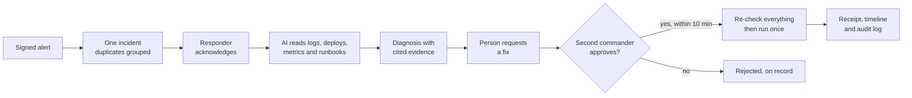

1. **Alerts become one incident.** Monitoring tools send signed alerts. Fifty alerts about the same problem become one incident, and the most serious problems stay on top.
2. **The AI does the homework.** It reads the evidence it is allowed to see and returns facts, hypotheses, known gaps and next checks. Every claim links to a real evidence record.
3. **Secrets stay hidden.** Passwords, tokens and keys are blacked out before anything is stored, shown or sent to the AI.
4. **AI suggests, people decide.** A person turns the suggestion into a request. A *different* commander must approve it. The approval is locked to that exact change and expires after ten minutes.
5. **Checked again, run once.** Just before running, permissions, the target, the plan and the stop switch are checked again. The fix runs exactly once; an uncertain result is verified, never blindly retried.
6. **Everything is on the record.** Timeline, audit log and a postmortem draft that separates confirmed facts from open questions.

## Screenshots

<table>
  <tr>
    <td width="50%">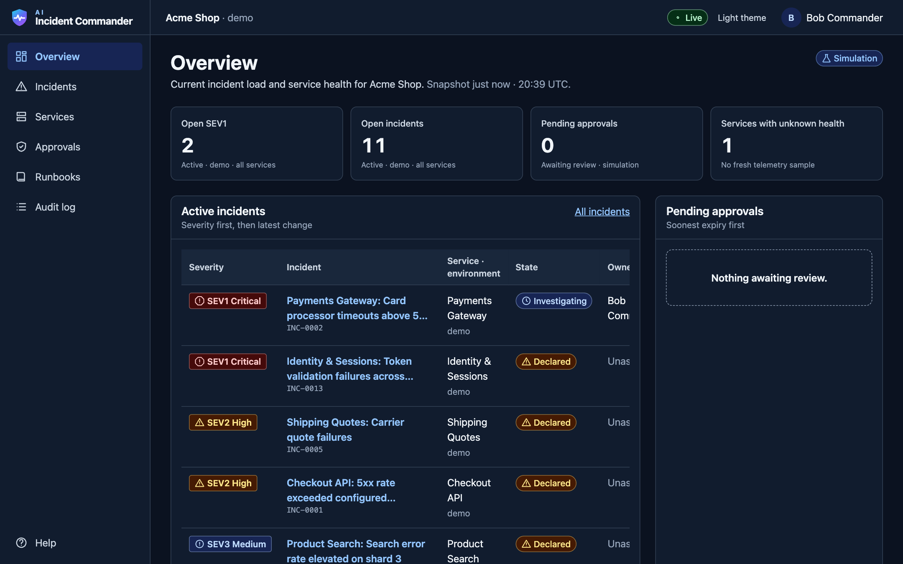<br><sub><b>Overview.</b> What needs attention right now, updated live.</sub></td>
    <td width="50%">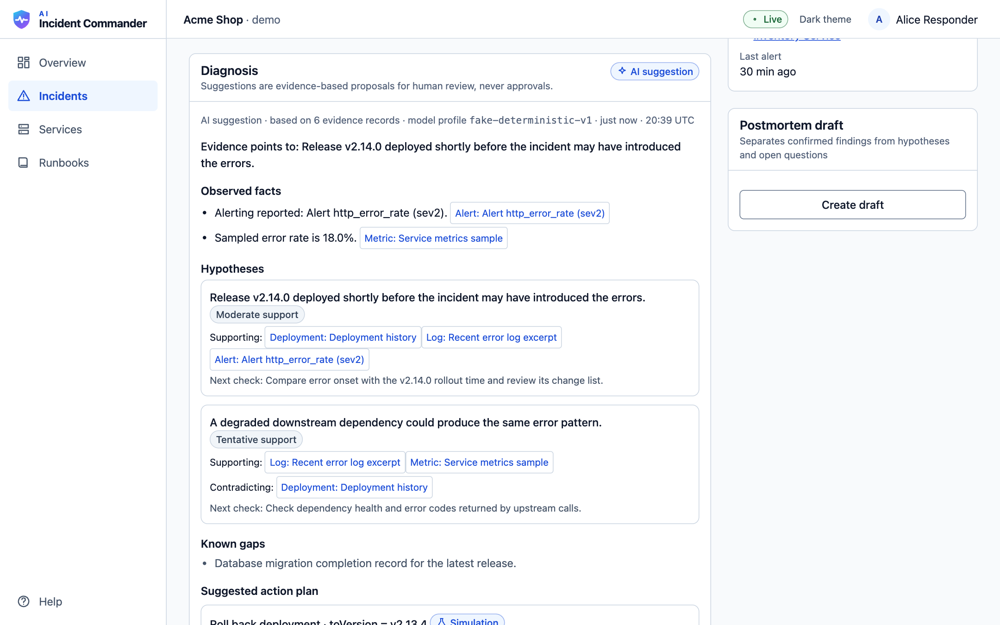<br><sub><b>AI diagnosis.</b> Facts and hypotheses, each linked to evidence.</sub></td>
  </tr>
  <tr>
    <td>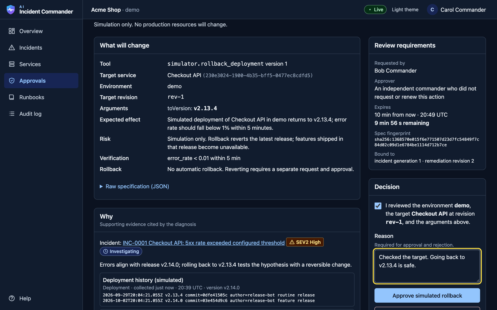<br><sub><b>Approval review.</b> The exact change, its risk and its expiry, approved by a second person.</sub></td>
    <td>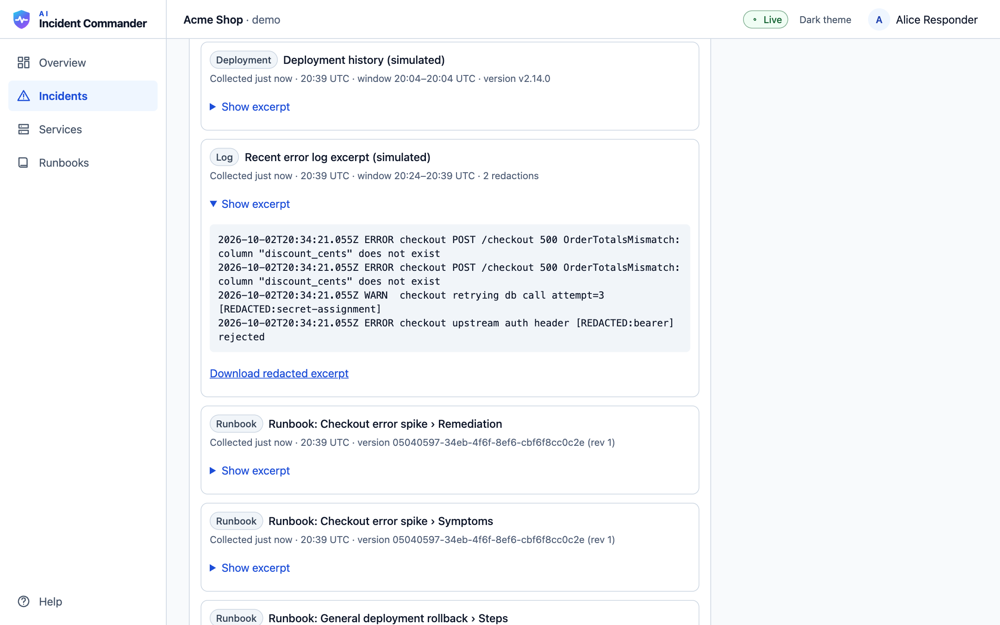<br><sub><b>Evidence.</b> Secrets are redacted automatically.</sub></td>
  </tr>
  <tr>
    <td>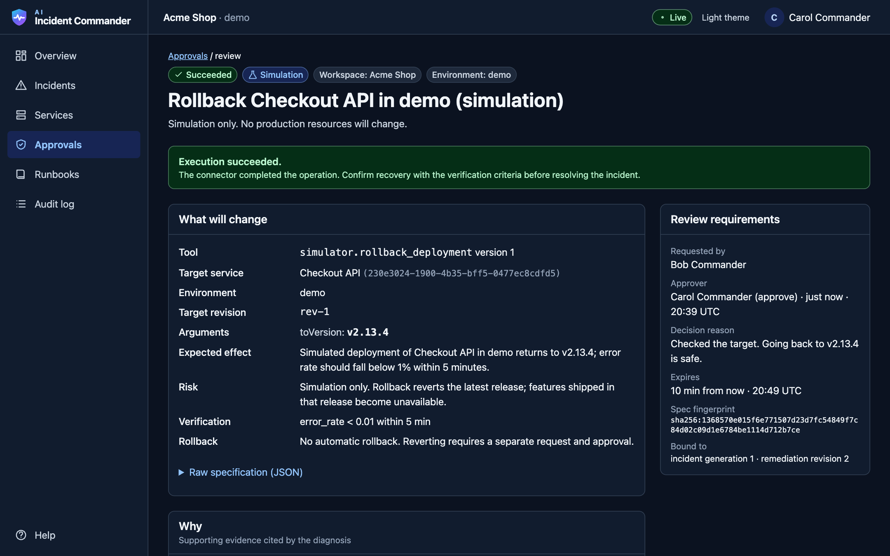<br><sub><b>Execution.</b> Runs once, with a receipt and recovery check.</sub></td>
    <td>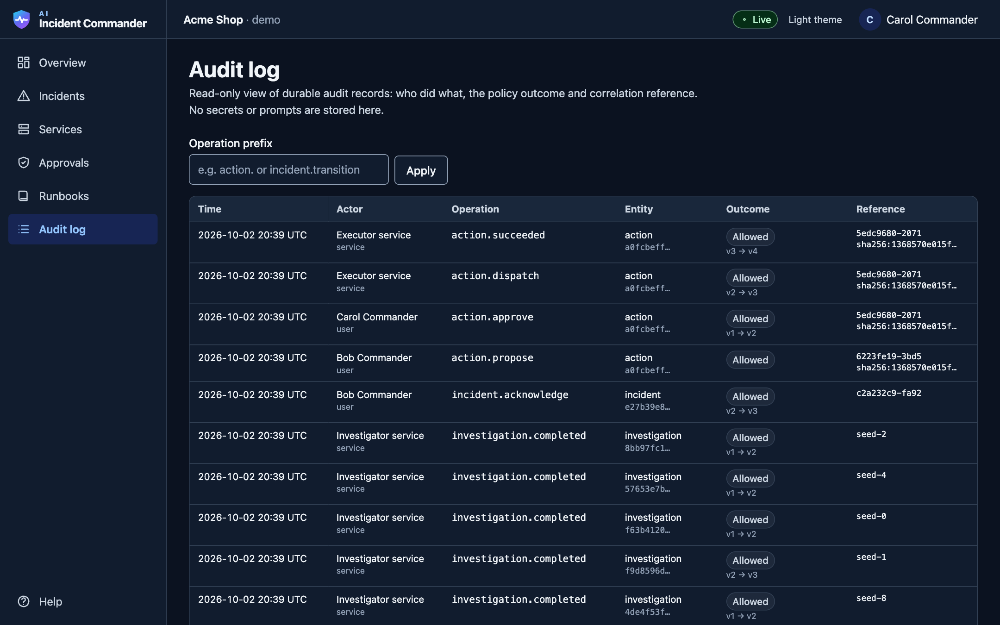<br><sub><b>Audit log.</b> Who did what, when and why, including blocked attempts.</sub></td>
  </tr>
  <tr>
    <td>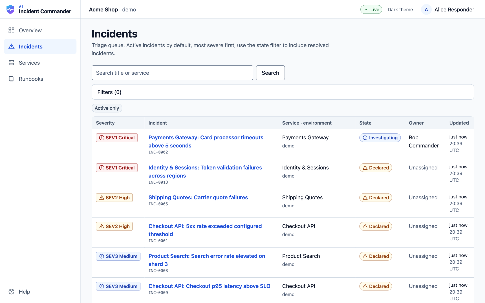<br><sub><b>Incidents.</b> One row per real problem, most serious first.</sub></td>
    <td align="center">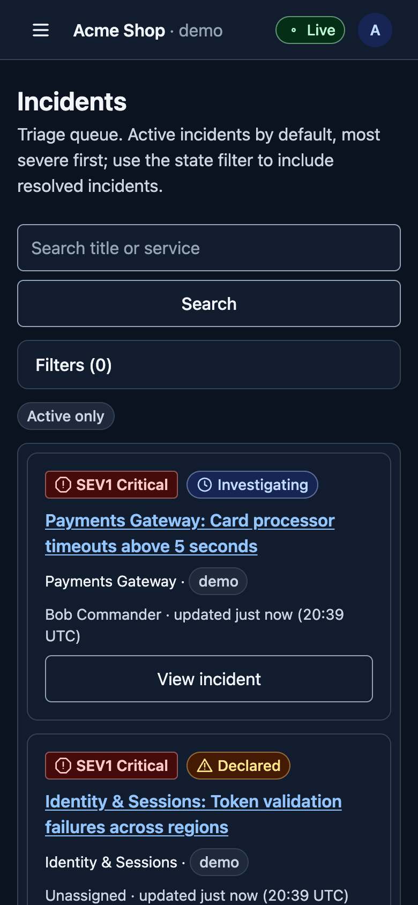 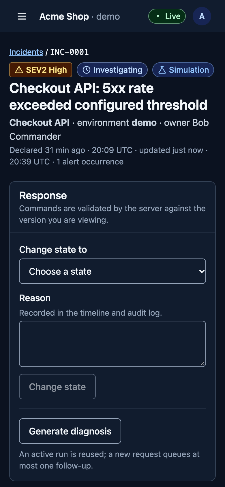<br><sub><b>Phone.</b> Every task works from 320 px up.</sub></td>
  </tr>
</table>

## Features

- **Live dashboard** with honest connection status (Live, Reconnecting, Updates delayed, Offline).
- **Cited AI diagnosis** inside a bounded workflow: time, token and tool budgets; one repair attempt; citation validation.
- **Two-person approval** bound to an immutable spec hash, incident revision and a 10 minute expiry. Renewals keep the original requester.
- **Exactly-once effects** through a transactional outbox, durable job leases with fencing tokens and stable execution keys.
- **Unknown-outcome handling**: timeouts become `outcome_unknown` and are reconciled before anything else happens.
- **Secret redaction** and **prompt-injection flagging** for every piece of evidence.
- **Versioned runbooks**: upload, index, then a commander publishes; search only returns the published version.
- **Reviewed plugins** with per-workspace grants, connection tests and instant revocation.
- **Tenant isolation**: every record and query carries `workspaceId`; other tenants get a uniform 404.
- **Postmortem drafts**, **dispatch stop switch**, **keyboard and screen reader support**, **light and dark themes**.
- **Works without AI**: if the model provider is down, the manual workflow still works.

## Tech stack

| Layer | Technology | What it does here |
| --- | --- | --- |
| Web app | **Next.js 16, React 19, TypeScript** | The dashboard. Client components talk only to the same-origin API. |
| Styling | **Tailwind CSS 4** | Design tokens for light and dark themes, project breakpoints (640 / 768 / 1024 / 1440). |
| Data on screen | **TanStack Query** | Caches API data per workspace and refetches when the live stream says something changed. |
| API | **Express 5** | Sessions, CSRF checks, roles and every command (idempotency keys and version checks on all writes). |
| Validation | **Zod 4** | One shared schema strategy for requests, responses and AI output. Unknown fields are rejected. |
| Database | **MongoDB 8 (replica set)** | Source of truth. A change, its timeline entry, audit record, live event and follow-up job commit in one transaction. |
| Queue | **Redis + BullMQ** | Delivers background jobs at least once. Durable job records make duplicates harmless. |
| Live updates | **Server-Sent Events** | Pushes small change notices with replay cursors; the browser refetches authorized data. |
| Worker | **Node worker process** | Runs investigations, approved actions, reconciliation, runbook indexing and postmortems. |
| AI | **Provider adapters + bounded workflow** | Swappable models behind one interface. The demo uses a deterministic test model; real providers plug in later. |
| Tools | **Policy gateway + plugin manifests (`ic.plugin/v1`)** | Every tool call must pass workspace, plugin, scope, target and approval checks. |
| Testing | **Vitest + mongodb-memory-server + Supertest, Puppeteer** | 34 unit and 44 integration tests against a real replica set, plus 19 end-to-end checks of the public demo. |
| Monorepo | **pnpm workspaces** | `apps/` for runnable programs, `packages/` for shared code. |
| Showcase site | **Next.js static export on Vercel** | The public product page in `apps/site`, with the live demo at `/demo`. |
| Video | **Puppeteer, ffmpeg, Gnani Vachana TTS** | Records real app footage, animates it and adds the narration. |

## Architecture

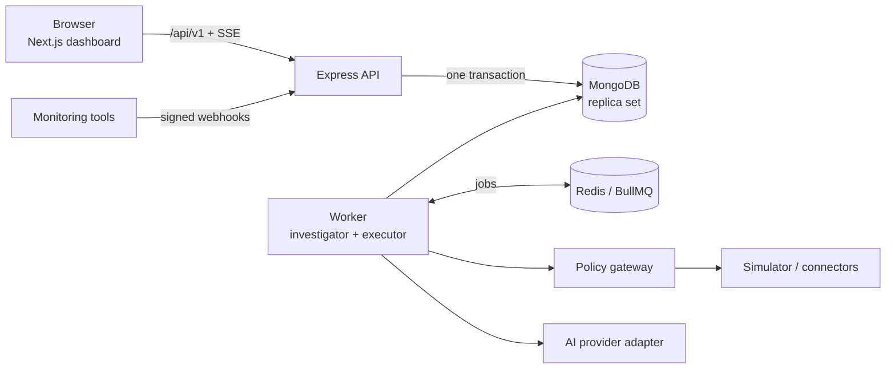

```text
apps/
  web/        Next.js dashboard (features, design system, realtime client)
  api/        Express transport: sessions, CSRF, routes, SSE stream
  worker/     Outbox dispatcher and BullMQ consumers (investigator, executor)
  site/       Public showcase site (static export, deployed to Vercel)
packages/
  contracts/  Shared Zod schemas, DTOs, enums, error codes, plugin manifest validator
  domain/     Pure rules: state machines, permissions, approval and dispatch checks, hashing
  core/       Services, persistence, event writer, idempotency, AI workflow, gateway, simulator, jobs
docs/         Product, architecture, design, AI and operations specifications
media/        Explainer video, poster, captions and the scripts that produced them
scripts/      Local replica set, migrations, seed data, signed test alert
infra/        Docker Compose for MongoDB and Redis
```

The dependency direction is `transport → application → domain/contracts`. Domain code imports no Express, React, MongoDB or AI SDK.

## Run it locally

**Requirements:** Node 22 or newer and Redis. MongoDB runs as a local replica set that the project starts for you (or use Docker). No paid services or API keys are needed.

```bash
git clone https://github.com/Omiii-215/ai-incident-commander.git
cd ai-incident-commander
cp .env.example .env
npx pnpm@12.8.1 install
```

Start MongoDB (terminal 1) and keep it running:

```bash
npx pnpm@12.8.1 dev:mongo
```

With `redis-server` running, load demo data and start everything (terminal 2):

```bash
npx pnpm@12.8.1 seed
npx pnpm@12.8.1 dev
```

Open <http://localhost:3000> and sign in as a demo user. Prefer Docker? `docker compose -f infra/docker-compose.yml up -d` starts MongoDB and Redis instead of `dev:mongo`.

### Demo users

| User | Workspace | Roles | Try this |
| --- | --- | --- | --- |
| Alice Responder | Acme Shop | responder | Acknowledge an incident, request a diagnosis |
| Bob Commander | Acme Shop | commander, responder | Request a rollback (then try to approve it yourself) |
| Carol Commander | Acme Shop | commander | Approve Bob's request |
| Dave Admin | Acme Shop | admin | Manage plugins and grants |
| Erin Auditor | Acme Shop | auditor | Read the audit log |
| Gina Commander | Globex Corp | commander | Confirm you cannot see Acme's data |

Send a new signed alert while the app is open and watch it appear live:

```bash
npx pnpm@12.8.1 send-alert checkout http_error_rate sev2 "5xx spike"
```

### Scripts

| Command | What it does |
| --- | --- |
| `pnpm dev:mongo` | Local single-node MongoDB replica set on port 27018 |
| `pnpm migrate` | Create collections, validators and indexes |
| `pnpm seed` | Reset and load two demo workspaces (local and CI only) |
| `pnpm dev` | Run API (:4000), worker and web (:3000) together |
| `pnpm send-alert` | Send one signed synthetic alert |
| `pnpm typecheck` | Strict TypeScript across every package |
| `pnpm test` | Unit and integration tests (in-memory replica set) |
| `pnpm build` | Production build of the dashboard |
| `pnpm demo:capture` | Record a fresh sample-data snapshot for the public demo (needs the local app running) |
| `pnpm build:site` | Build the static demo dashboard and the showcase site |
| `pnpm test:demo` | 19 end-to-end checks of the public demo across every role (`BASE=<url>` to test a deployment) |

## Testing

```bash
npx pnpm@12.8.1 test
```

The integration suite runs against a real MongoDB replica set and covers the things that must never break: cross-workspace access, duplicate and replayed alerts, concurrent correlation, idempotency and version conflicts, self-approval, expiry, stale plans, concurrent approvers, revoked connectors and members, the stop switch, duplicate job delivery, `outcome_unknown` reconciliation, citation repair, provider outages, secret redaction, CSRF, and SSE replay and resync.

## Security model in one minute

- Workspace membership is derived on the server; IDs from the browser are never trusted.
- Every write needs an `Idempotency-Key`; writes to existing records need `If-Match` with the version you saw.
- AI output and evidence are untrusted data. They cannot grant permissions, change tools or approve anything.
- The person who asked can never approve. Approval binds to one spec hash and expires in 10 minutes.
- Just before running, membership, grants, revisions, expiry and stop switches are checked again.
- No secrets in the browser, logs, AI prompts or audit records. The demo login is refused outside local and CI.

## Project status

This is the **M0 and M1 MVP**: the full workflow works end to end against a **deterministic simulator** with **sample data** and a **test AI model**. Not yet built: OIDC sign-in, real OpenAI or Anthropic adapters, vector search, PDF runbooks, production write actions, browser end-to-end tests and load testing. See [implementation status](docs/engineering/IMPLEMENTATION_STATUS.md) for what is verified and what differs from the specification.

## Documentation

| Area | Documents |
| --- | --- |
| Product | [Requirements](docs/product/REQUIREMENTS.md) |
| Architecture | [System design](docs/architecture/SYSTEM_DESIGN.md), [HLD](docs/architecture/HLD.md), [LLD](docs/architecture/LLD.md), [diagrams](docs/architecture/ARCHITECTURE_DIAGRAMS.md) |
| Contracts | [Data model](docs/architecture/DATA_MODEL.md), [API](docs/architecture/API_CONTRACTS.md), [events and sequences](docs/architecture/EVENT_FLOWS.md) |
| Dashboard | [UX](docs/design/DASHBOARD_UX.md), [design system](docs/design/UI_DESIGN_SYSTEM.md), [responsive rules](docs/design/RESPONSIVE_RULES.md), [accessibility](docs/design/ACCESSIBILITY.md), [frontend architecture](docs/design/FRONTEND_ARCHITECTURE.md) |
| AI and extensions | [AI orchestration](docs/ai/AI_ORCHESTRATION.md), [plugin system](docs/ai/PLUGIN_SYSTEM.md), [agent compatibility](docs/ai/AGENT_COMPATIBILITY.md), [security and permissions](docs/ai/SECURITY_AND_PERMISSIONS.md) |
| Delivery | [Implementation status](docs/engineering/IMPLEMENTATION_STATUS.md) |
| Operations | [Deployment](docs/operations/DEPLOYMENT.md), [observability and runbooks](docs/operations/OBSERVABILITY_AND_RUNBOOKS.md) |
| Decisions | [Architecture decision log](docs/decisions/ADR.md) |
| Brand | [Logo, mark and favicons](docs/brand) |
| Coding assistants | [AGENTS.md](AGENTS.md), [CLAUDE.md](CLAUDE.md), [GEMINI.md](GEMINI.md), [Copilot instructions](.github/copilot-instructions.md) |

## The explainer video

[`media/explainer`](media/explainer) holds the 2:19 video, its subtitles ([SRT](media/explainer/captions.srt), [WebVTT](media/explainer/captions.vtt)), the [narration script](media/explainer/SCRIPT.md) and the [scripts](media/explainer/source) that made it: Puppeteer records real footage of the running app, an HTML stage animates it frame by frame, ffmpeg assembles it, and Gnani Vachana TTS provides the voice (your own key goes in an ignored `.gnani.env` file).

## Showcase site and live demo

The public page lives in [`apps/site`](apps/site) and is a static Next.js export. Its live demo at `/demo` is **the real dashboard** (`apps/web`) built as static files with `NEXT_PUBLIC_DEMO=1`. In that build, API calls go to a small in-browser backend ([`apps/web/lib/demo`](apps/web/lib/demo)) instead of the network:

- data comes from a snapshot of the real API with sample data (`pnpm demo:capture`), re-anchored to the visitor's current time;
- permissions, the incident lifecycle, approval binding and dispatch checks reuse the same rules package as the server ([`packages/domain`](packages/domain)), so the demo refuses exactly what the real app refuses;
- live updates, simulated execution, reconciliation and expiry are driven in the browser, and state lasts for the browser tab.

The demo is not a hosted backend: there is no database, sign-in or network call behind it.

```bash
npx pnpm@12.8.1 build:site                      # builds the demo dashboard, then the site into apps/site/out
cd apps/site
mkdir -p .vercel/output && cp -R out .vercel/output/static && echo '{"version":3}' > .vercel/output/config.json
vercel deploy --prebuilt --prod                 # publishes the static files
```

## Contributing

Read [AGENTS.md](AGENTS.md) first: it holds the architecture and safety rules every change must keep (tenant scoping, one-transaction writes, human approval, no optimistic approvals in the UI). Run `pnpm typecheck` and `pnpm test` before opening a pull request.

## License

No license has been chosen yet, so the default copyright applies. Open an issue if you would like to use the code.
