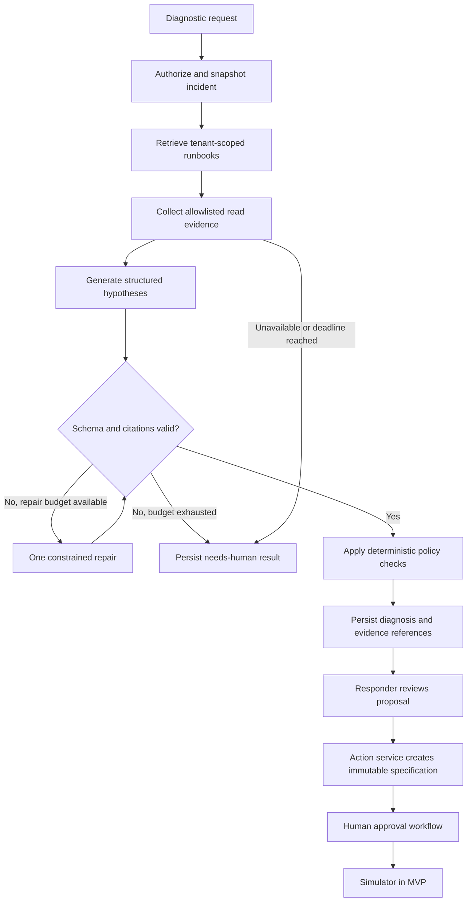

# AI orchestration

Status: proposed implementation specification, 2026-10-02. No model integration is installed. Numerical limits below are initial configuration defaults to validate, not measured capability.

Related: [HLD](../architecture/HLD.md), [LLD](../architecture/LLD.md), [plugin contract](PLUGIN_SYSTEM.md), [permissions](SECURITY_AND_PERMISSIONS.md), [test strategy](../engineering/TEST_STRATEGY.md).

## 1. Runtime responsibility

The runtime helps a responder assemble evidence, compare explanations, and propose a bounded next step. The authoritative incident, action, approval, and audit records belong to the application services. Model text never updates these records directly.

Use an explicit LangGraph workflow through a small LangChain integration layer. Each node has a typed input, output validator, timeout, and named failure path. Avoid an open-ended autonomous loop. The simulator is the only executor enabled in the MVP.

| Concern | Owner | Persisted output |
|---|---|---|
| Authorize a diagnostic request | API authorization service | Requester, workspace, incident, idempotency record |
| Select a scenario and evidence scope | Deterministic coordinator | Snapshot version and service/environment filters |
| Retrieve runbooks | Retrieval service | Chunk IDs, document versions, retrieval scores |
| Read live context | Policy gateway and scoped connector | Redacted evidence envelope and collection time |
| Produce hypotheses | Selected model adapter | Validated diagnosis document |
| Check source references | Deterministic citation validator | Citation validation result |
| Request remediation | Action service | Immutable action specification |
| Approve and dispatch remediation | Human commander and action worker | Approval decision and execution attempts |

## 2. Bounded workflow



The diagram's approval branch is a separate durable business workflow. Resuming a model graph does not constitute approval. Human comments are new evidence only after normalization; a comment containing an instruction cannot grant permissions.

| Limit | Initial default | Exhaustion behavior |
|---|---:|---|
| End-to-end investigation deadline | 90 seconds | Save partial evidence as `degraded` with a human-review reason |
| First diagnosis latency target | p95 below 45 seconds | Measure separately from the deadline |
| Graph node transitions | 12 | Stop and audit budget exhaustion |
| Model generations | 2, including repair | No recursive self-correction |
| Read tool calls | 6 total; at most 3 concurrent | Return a missing-evidence list |
| Single connector call | 8 seconds | Retry read once only if deadline permits |
| Aggregate prompt tokens | 24,000 input tokens per diagnosis | Reduce evidence deterministically |
| Aggregate output tokens | 4,000 per diagnosis | Reject incomplete output; use remaining repair budget |
| Retrieved chunks | 8; at most 2 per document initially | Diversify and deduplicate |
| Redacted tool output | 64 KiB per call | Store bounded excerpt and truncation marker |

Provider context limits and workspace quotas may reduce these values. Token accounting includes retries and repair. Estimate cost before dispatch using a versioned provider rate configuration; reserve workspace budget and settle against actual usage. An unavailable price entry blocks optional paid execution until configured.

## 3. State and durable progress

Proposed TypeScript workflow view of `investigation_runs`; names describe future code, not present exports. Persist the canonical run state separately from its transient UI phase. The fields in [data model](../architecture/DATA_MODEL.md) remain the storage contract:

```typescript
type InvestigationState =
  | "queued" | "running" | "completed" | "degraded" | "failed" | "cancelled";

interface InvestigationWorkflowView {
  id: string;
  workspaceId: string;
  incidentId: string;
  requesterId: string;
  generation: number;
  inputRevision: number;
  remediationRevision: number;
  state: InvestigationState;
  phase: "authorizing" | "retrieving" | "collecting" | "generating" | "validating";
  rerunRequested: boolean;
  workflowVersion: string;
  promptVersion: string;
  providerProfile: string;
  evidenceIds: string[];
  checkpointRef: string | null;
  budget: { modelCalls: number; toolCalls: number; inputTokens: number;
    outputTokens: number; deadlineAt: string };
  leaseToken: number;
  version: number;
}
```

- Persist each completed node result and its schema version in the Mongo-backed worker checkpoint before scheduling the next node. `checkpointRef` identifies that checkpoint; use conditional version and fencing-token checks to reject a superseded worker.
- Commit run status, audit event, workspace stream event, and next outbox item together where they change. Redis is a delivery mechanism, not the checkpoint record.
- A model call can finish just before a process dies. Repeating a diagnosis may incur cost and produce different text; only the winner of the version check is published.
- Cache accepted node output using workspace, run ID, node name, evidence checksum, and workflow version. Never use a cache shared across tenants for private content.
- Resume the last committed node under a new lease. Use the LLD's 60-second lease, 15-second renewal and 30-second provider-call timeout within the 90-second total budget. A new incident remediation revision marks an old result as superseded and prevents its use for approval.
- Coalesce requests while one investigation is queued/running by setting `rerunRequested`. At completion, schedule at most one follow-up using current incident generation and input revision; do not start an unbounded run per alert.
- LangGraph execution can use an in-process graph for each bounded job while the application's node records provide restart recovery. Do not add a second source of action truth in a graph checkpoint store.
- If a LangGraph checkpointer is introduced later, choose and test a persistent adapter, define retention, and document its relationship to Mongo node records. In-memory checkpointing does not survive process restart. [LangGraph persistence](https://docs.langchain.com/oss/javascript/langgraph/persistence).

## 4. Evidence and retrieval

Ingestion sequence: authenticate uploader → validate format and size → malware scanning where supported → extract text → redact secrets → record document version → chunk by heading → embed in a worker → publish searchable version atomically.

1. Accept Markdown, plain text and PDF up to 10 MiB and, for paginated documents, 100 pages. Validate file signatures and extraction quality; reject encrypted/unsupported PDFs. Unreadable scanned content reports an actionable extraction failure until a reviewed OCR adapter is available.
2. Each chunk stores workspace, document ID/version, section, source checksum, allowed audience, and service/environment tags. A chunk inherits the document's access restrictions.
3. Use a starting chunk size around 600 tokens with up to 80 overlap; preserve headings. Tune using the evaluation corpus instead of silently changing these values.
4. Query filters include workspace and allowed document audience before retrieval. Apply service/environment narrowing when present and label any broader fallback.
5. Production uses Atlas Vector Search with indexed tenant filters. Local mode uses deterministic lexical ranking; display the retrieval mode in debug diagnostics.
6. Store the embedding model identifier and dimensions with the index configuration. A model change builds a new index, backfills, evaluates, then swaps an alias; it never mixes incompatible vectors.
7. Removed documents immediately become unavailable to queries. Async cleanup removes embeddings and objects after the retention workflow; cached evidence checks revocation before display.
8. Live logs and metrics carry a collection interval. Treat a runbook instruction and an observed metric as different evidence types, even when they agree.
9. Responder/commander uploads produce draft versions. A commander publishes a ready version through the canonical runbook API; search includes only the published active version. Readiness alone does not grant publication.

Citation format in model output:

```json
{
  "summary": "Elevated errors began after the latest deployment.",
  "hypotheses": [{
    "id": "hypothesis-1",
    "statement": "The new deployment may be incompatible with the database schema.",
    "support": ["evidence-17", "runbook-4:version-3:chunk-2"],
    "contradictions": ["evidence-19"],
    "strength": "tentative",
    "nextCheck": "Compare schema migration completion with deployment time."
  }],
  "missingEvidence": ["Migration completion record"],
  "suggestedActions": []
}
```

Evidence IDs in this illustrative payload are not production UUIDs. Production references use validated internal IDs. The validator must resolve every reference in the authorized evidence set. It rejects invented IDs, expired evidence, and inaccessible sources. It checks reference validity; it cannot prove that a claim follows from a passage. Entailment remains a separate evaluation and human-review concern.

## 5. Prompt boundaries and output handling

- Build the trusted instructions from versioned repository templates. Add authorized context and source excerpts in separately labeled data fields.
- Excerpts can contain hostile instructions. The gateway enforces tool scope regardless of model output, including instructions to change workspace, reveal secrets, or disable approvals.
- Tool descriptions come from the reviewed registry version. Dynamic remote tool discovery cannot broaden the live tool allowlist.
- The model may return only the configured structured diagnosis schema. Unknown fields, invalid enum values, oversized strings, and undeclared tools are rejected.
- Show concise evidence-based explanations and alternatives. Do not collect or expose hidden model reasoning.
- A suspected injection marks the affected source and excludes it from action justification until a human reviews it. Keep other authorized evidence available.
- Escape all output and sanitize rendered Markdown; disallow raw HTML, scripts, embedded forms, and automatic remote image loads.

## 6. Provider abstraction

| Adapter operation | Contract |
|---|---|
| `describeCapabilities()` | Report tested structured output, tool-call, streaming, context and region capabilities for one pinned profile |
| `generateDiagnosis(input, signal)` | Accept normalized evidence and schema; return structured result or typed error |
| `estimateBudget(input)` | Estimate token and money bounds before dispatch |
| `normalizeUsage(raw)` | Preserve provider usage and normalized token fields; use `unknown` when unavailable |
| `classifyError(error)` | Distinguish timeout, quota, invalid schema, policy refusal, authentication and transient failure |

Ship provider interfaces plus a deterministic fake provider first. Add OpenAI and Anthropic Claude adapters after contract tests. Model IDs are deployment configuration and must be verified against the chosen account at implementation time. Optional Gemini or local providers require the same test suite; compatibility is not inferred from an OpenAI-shaped endpoint.

Fallback is workspace opt-in because it may send data to another vendor. A fallback must preserve region, data-classification, schema, and budget constraints. Change provider only before a new generation; record the actual provider on each attempt. Never silently switch a write executor.

## 7. Evaluation and release gate

Initial corpus: 60 synthetic incidents split into 30 development, 15 validation, and 15 held-out scenarios. Include duplicate alerts, missing runbooks, stale logs, contradictory sources, malicious source text, multilingual log messages, provider outages, and cross-tenant canaries. Keep target answers and scenario variants out of runtime prompts.

| Gate | Proposed threshold |
|---|---|
| Unauthorized tool dispatch or tenant leakage | Zero in deterministic and adversarial suites |
| Resolved citation IDs | 100% of published citations |
| Correct source support | At least 95% of sampled claims, human scored with rubric |
| Relevant runbook retrieval | Recall@8 at least 90% on labeled cases |
| Diagnostic usefulness | At least 80% scored actionable and appropriately qualified |
| Abstention when evidence is insufficient | At least 90% of designated insufficient-evidence cases |
| Cost and latency | Within configured limits; report p50/p95 and sample count |

These are go/no-go proposals, not claims of accuracy. Keep a human-reviewed rubric and disagreement notes. Compare prompt, model, retrieval, and plugin changes against the same frozen validation cases; run held-out cases at release. A failed safety gate blocks release even when average usefulness improves.

## 8. Operational visibility

Emit run ID, workspace ID, incident ID, workflow/prompt version, node duration, budget consumed, retrieval mode, redaction count, failure reason, and provider profile. Keep content out of operational logs by default. LangSmith tracing is opt-in per workspace and redacted before export; disabling it must not break diagnostics. OpenTelemetry covers queue lag, model latency, denied tools, and abandoned leases.

When AI is unavailable, responders retain incident updates, manual runbook search, evidence inspection, and simulator actions. Show the last successful diagnosis timestamp and a retry button with current quota status. Do not present stale results as a live diagnosis.
