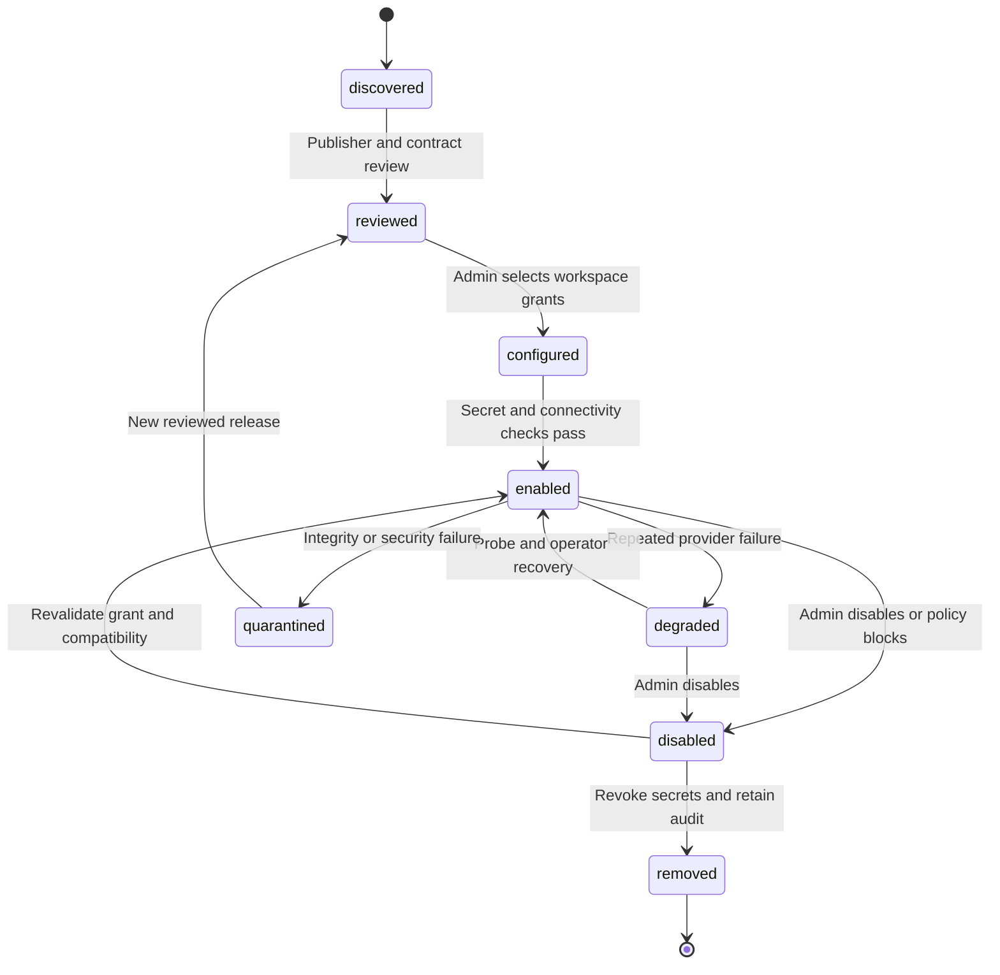
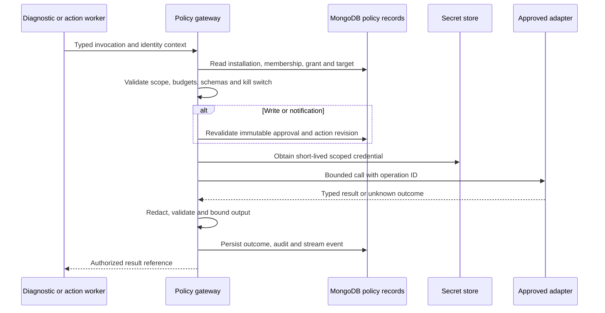

# Application plugin system

Status: proposed project protocol, version `1.0.0`, 2026-10-02. This document specifies future application connectors. It is not a Codex, Claude Code, Gemini CLI, or marketplace installation manifest. No plugin is installed by this documentation package.

Related: [host compatibility](AGENT_COMPATIBILITY.md), [security](SECURITY_AND_PERMISSIONS.md), [AI workflow](AI_ORCHESTRATION.md), [API contracts](../architecture/API_CONTRACTS.md).

## 1. Plugin boundaries

An application plugin contributes one or more approved capabilities: alert ingestion, evidence reads, runbook ingestion, notification drafts, simulator actions, or later a tightly scoped production action. The core application owns identity, policy, approvals, audit, persistence, and rendering.

| Extension layer | Runs where | Authority |
|---|---|---|
| Coding-host skill/plugin | Developer's chosen AI tool | Host permissions and explicitly granted development scope |
| Application connector adapter | Isolated backend worker or approved remote service | Per-workspace installation grant |
| Model tool | Through the application policy gateway | Intersection of actor, installation, workflow and target policy |
| Dashboard contribution | Core renderer consumes declarative widget data | Same API authorization as the rest of the dashboard |

Installing a coding-host plugin never enables an application connector. Enabling an application connector never authorizes a coding agent to call its production credentials. An MCP connection is a tool transport; it does not replace application authorization.

## 2. Registry and installation records

- `plugin_catalog` is global metadata: immutable manifest version, reviewed publisher, digest, compatibility, support policy, and review outcome. It contains no tenant secrets.
- `plugin_installations` is tenant data: workspace, catalog ID/version, approved permissions, environment/service restrictions, secret reference, configuration revision, and state.
- Invocation records carry workspace, installation, capability version, actor/run/action, arguments hash, attempt, timestamps, provider request ID, outcome and redacted result reference. Link reads to durable `job_runs` and evidence; link action calls to `executions`. Avoid a second independent source of action outcome truth.
- The manifest is immutable after publication. Installation changes use optimistic version checks and an audit event.
- The catalog can describe a capability; only an enabled installation with a matching grant can use it.
- Treat publisher identity, artifact digest, and review as separate facts. A signature verifies provenance; it does not prove safe behavior.

## 3. Manifest shape

The following is an original application manifest example. `ic.plugin/v1` is the schema family and `1.0.0` is the plugin release. Endpoint and digest values are illustrative placeholders; implementation resolves endpoint aliases and real artifact digests from the reviewed registry.

```json
{
  "schemaVersion": "ic.plugin/v1",
  "id": "core.synthetic-alerts",
  "version": "1.0.0",
  "displayName": "Synthetic Alerts",
  "publisher": "incident-commander-core",
  "minHostVersion": "0.1.0",
  "runtime": "builtin-adapter",
  "adapterId": "synthetic-alerts-v1",
  "permissions": ["alerts:ingest", "simulations:execute"],
  "secretSlots": [],
  "egressAliases": [],
  "capabilities": [
    {
      "name": "emit_alert",
      "version": "1",
      "kind": "ingest",
      "inputSchemaRef": "synthetic-alert-input-v1",
      "outputSchemaRef": "alert-receipt-v1",
      "maxDurationMs": 5000,
      "maxOutputBytes": 65536,
      "idempotency": "required",
      "approval": "none"
    },
    {
      "name": "simulate_restart",
      "version": "1",
      "kind": "simulate",
      "inputSchemaRef": "simulation-restart-input-v1",
      "outputSchemaRef": "simulation-result-v1",
      "maxDurationMs": 5000,
      "maxOutputBytes": 65536,
      "idempotency": "required",
      "approval": "independent-commander"
    }
  ],
  "subscriptions": [{ "type": "incident.created", "schemaVersion": 1 }],
  "widgets": [{ "slot": "incident.context", "type": "status-card", "dataKey": "scenario" }]
}
```

Normative field rules for the version 1 validator:

| Field | Constraint |
|---|---|
| `schemaVersion` | Exact `ic.plugin/v1`; unknown major rejected |
| `id` | 3–80 characters, lowercase namespace/name, pattern `^[a-z0-9]+([.-][a-z0-9]+)+$` |
| `version`, `minHostVersion` | Valid Semantic Versioning values; no `latest` alias |
| `runtime` | `builtin-adapter` or `remote-mcp`; arbitrary package installation is unsupported |
| `adapterId` | Reviewed adapter registry key; forbidden for `remote-mcp` |
| `mcpEndpointAlias` | Required only for `remote-mcp`; resolves through approved endpoint registry |
| `permissions` | Unique members of explicit scope enum; maximum 16; no wildcard |
| `secretSlots` | Names only, maximum 4; references resolved from installation secret store |
| `egressAliases` | Approved network-policy aliases, maximum 8 |
| `capabilities` | 1–20 entries; unique name/version; strict input/output schemas |
| `subscriptions` | At most 8 `{type, schemaVersion}` pairs from the canonical event registry |
| `widgets` | At most 4 registered slot/type combinations |

All objects reject unknown fields unless a later schema explicitly defines an extension field. A manifest is at most 64 KiB. Schema references are immutable registry IDs, never external URLs or arbitrary local paths. Validate the full manifest and every referenced schema before installation.

Version 1 application scope vocabulary:

| Scope | Allowed operation |
|---|---|
| `alerts:ingest` | Submit signed, normalized alerts for configured services |
| `runbooks:ingest` | Submit candidate documents to the reviewed publication workflow |
| `runbooks:read` | Retrieve authorized published passages |
| `logs:read` | Retrieve a bounded log excerpt through approved queries |
| `metrics:read` | Read approved service metrics and time windows |
| `git:read` | Read selected repository deployment context |
| `notifications:draft` | Create a local draft with no external send |
| `notifications:send` | Send the exact approved payload to a selected channel |
| `tickets:read` | Read selected project tickets |
| `tickets:write` | Apply an approved ticket create/update payload |
| `simulations:execute` | Apply approved changes to the fake service model |
| `remediations:execute` | Execute an approved allowlisted production operation |

Scopes describe application policy, not vendor OAuth scopes. Each adapter maps them to narrower provider grants and checks both. A local notification draft uses a non-mutating tool; sending it is a separate `notify` capability.

Illustrative installation grant record, using placeholder IDs for readability:

```json
{
  "workspaceId": "workspace-demo",
  "installationId": "installation-synthetic",
  "pluginId": "core.synthetic-alerts",
  "pinnedVersion": "1.0.0",
  "grants": ["alerts:ingest", "simulations:execute"],
  "allowedServiceIds": ["service-checkout"],
  "allowedEnvironments": ["demo"],
  "secretRefs": {},
  "status": "enabled",
  "version": 1
}
```

Production IDs are UUIDs. Empty allowed-target lists grant no target access. Omitted permissions are denied; wildcard service IDs and implicit production access are rejected. The installation's version is an optimistic concurrency counter, distinct from the plugin release version. Configuration stores secret references only and never literal credentials.

The capability schema is normative JSON Schema 2020-12, shown here as a fragment to embed in the future complete manifest schema:

```json
{
  "$schema": "https://json-schema.org/draft/2020-12/schema",
  "type": "object",
  "additionalProperties": false,
  "required": ["name", "version", "kind", "inputSchemaRef", "outputSchemaRef",
    "maxDurationMs", "maxOutputBytes", "idempotency", "approval"],
  "properties": {
    "name": { "type": "string", "pattern": "^[a-z][a-z0-9_]{1,63}$" },
    "version": { "type": "string", "pattern": "^[1-9][0-9]*$" },
    "kind": { "enum": ["ingest", "read", "simulate", "write", "notify"] },
    "inputSchemaRef": { "type": "string", "minLength": 1, "maxLength": 100 },
    "outputSchemaRef": { "type": "string", "minLength": 1, "maxLength": 100 },
    "maxDurationMs": { "type": "integer", "minimum": 100, "maximum": 30000 },
    "maxOutputBytes": { "type": "integer", "minimum": 256, "maximum": 1048576 },
    "idempotency": { "enum": ["required", "read-only"] },
    "approval": { "enum": ["none", "independent-commander"] }
  }
}
```

Semantic validation adds rules a structural schema cannot express conveniently: `write`, `notify`, and `simulate` require independent-commander approval; `read` uses `read-only`; write/notify/simulate require durable idempotency and declared result reconciliation. Ingest grants cannot be used as remediation grants. Runtime policy can impose stricter limits than a manifest, never weaker ones.

## 4. Lifecycle



1. **Discover:** present capabilities, requested scopes, data destinations, publisher, and compatible host versions.
2. **Review:** validate manifest, digest, schemas, egress policy, authentication flow, failure behavior, and license.
3. **Configure:** workspace admin grants specific scopes and targets; store only secret references in MongoDB.
4. **Test:** run a connectivity probe with harmless fixture data. Production writes cannot be part of this probe.
5. **Enable:** commit installation state, audit, stream event, and any initialization outbox job together.
6. **Upgrade:** install a new immutable version beside the old one, test in staging, show scope changes, and switch after review. Newly requested permissions stay ungranted.
7. **Disable:** revoke new dispatch, subscriptions, and secret leases. Existing invocation outcomes still reconcile.
8. **Remove:** delete configuration under retention policy and revoke credentials. Keep invocation and approval audit references readable without storing secret material.

An upgrade cannot replace the capability behind an approved action. Pending actions remain bound to their reviewed tool/version and spec hash or are invalidated and re-proposed. Renewal preserves original requester lineage, records the renewal actor and requires fresh approval independent of both for production. Downgrade requires configuration compatibility checks; it does not reverse provider-side changes.

## 5. Invocation path and enforcement



Compute effective permission as the intersection of actor membership, workspace policy, installation grant, capability declaration, workflow allowlist, and target restriction. The model cannot supply workspace identity or alter this intersection.

| Boundary | Required project behavior |
|---|---|
| Webhook ingress | Verify connector signature on raw body, timestamp tolerance and replay identity; cap body size before parsing |
| MCP discovery | Pin server identity and allowed tool descriptors; changes require registry review |
| Credential lookup | Worker receives short-lived access; model, browser, and telemetry receive no token |
| Network egress | Enforce approved destinations at network layer and application URL parser; recheck redirects and DNS resolution |
| Read result | Apply workspace tagging, output schema, redaction and size limits before use |
| Action dispatch | Recheck approval, revision, active membership, grant, expiry, target, and global/workspace/plugin stop flags |
| Completion | Persist provider request ID and normalized outcome; reconcile ambiguous results before another write |

Private operational endpoints require an explicitly configured private connector route with narrow host/port allowlists. General remote MCP connections cannot reach loopback, cloud metadata, or arbitrary private addresses. This distinction permits approved internal telemetry without exposing a general-purpose request proxy.

## 6. Domain hooks

Application hooks are subscriptions to versioned domain events, delivered through the Mongo outbox and BullMQ. They are independent of coding-host lifecycle hooks.

- Initial subscribed types: `incident.created`, `incident.transitioned`, `investigation.completed`, and `action.completed`, all with envelope `schemaVersion: 1`. Resolve notifications filter `incident.transitioned` by the authorized new status. Use the [canonical registry](../architecture/EVENT_FLOWS.md); do not add version suffixes to type names.
- Each delivery contains event ID, workspace ID, installation ID, schema version, occurred-at time, and a minimal authorized payload.
- Delivery is at least once. Record a unique `(installationId, eventId, handlerVersion)` completion key; keep workspace in the record and every query.
- Handlers cannot run inside the originating database transaction. A failed notification never prevents incident declaration.
- Use bounded retries with jitter for transient failures; after five attempts, expose a failed delivery for operator retry.
- Do not emit another identical domain event from its own handler. Track causation ID and cap event-chain depth at four.
- Event payloads do not confer authorization. A notification proposal must still pass the action approval workflow before sending.

## 7. Dashboard extension contract

Allow only registered widgets: `status-card`, `key-value-list`, `evidence-table`, `time-series`, and `action-link`. Plugins supply schema-validated data, labels, and internal entity references. The core renderer owns HTML, CSS, interaction, navigation and accessibility.

Reject scripts, arbitrary HTML, inline styles, external iframe URLs, remote image URLs, and executable expressions. An `action-link` opens the core review screen; it cannot dispatch a tool. Only core-approved HTTPS links may leave the app, with a visible destination. Apply the [design system](../design/UI_DESIGN_SYSTEM.md), [responsive rules](../design/RESPONSIVE_RULES.md), and [accessibility rules](../design/ACCESSIBILITY.md) to every widget.

Widget failures remain local to their panel and show a retry or unavailable state. A broken plugin must not hide the incident title, severity, timeline, or approval controls.

## 8. Initial catalog and delivery stages

| Plugin | Initial capability | Stage | Additional condition |
|---|---|---|---|
| Synthetic alerts | Seed incidents and replay fixture bursts | MVP | Development/demo workspaces only |
| Runbook library | Ingest Markdown/text/PDF; read published cited chunks | MVP | 10 MiB/100-page limit; commander publication and document audience enforced |
| Simulator | Preview and execute fake restart/rollback results | MVP | Persistent simulation label and independent approval |
| Logs adapter | Read a bounded service/time window | Later read integration | Redaction, query quota and fixed log index scope |
| Metrics adapter | Read approved time-series queries | Later read integration | Query templates, range and series cardinality caps |
| Git adapter | Read deployment commits, diffs and metadata | Later read integration | Selected repositories and immutable commit references |
| Slack adapter | Draft an incident update; later send approved text | Optional | Selected workspace/channel and explicit send approval |
| Ticketing adapter | Draft ticket fields; later create/update a ticket | Optional | Selected project and approved payload |
| Remediation adapter | One reversible allowlisted production action | Production milestone | Provider idempotency/reconciliation and operational drill |

These are planned adapters, not claims that third-party services share a common permission schema. Vendor OAuth scopes, rate limits, event signatures, and idempotency behavior must be mapped and verified per adapter.

## 9. Compatibility, testing and stop controls

- Major protocol changes require a new `schemaVersion`; minor adapter changes must preserve declared input/output behavior. Version the tool when its meaning or approval implications change.
- A contract suite tests malformed payloads, grant denial, secret redaction, duplicate deliveries, timeout, response size, provider rate limiting, revoked grants and unknown action outcomes.
- Test catalog tampering, remote tool-description changes, unsafe endpoint redirects, and cross-workspace installation references.
- Workspace admins can disable a connector; commanders can stop incident action dispatch; platform operators can activate the global stop control. Restarting dispatch requires an authorized human and an audit reason.
- Check stop controls immediately before dispatch. Revocation prevents future dispatch and cannot guarantee cancellation or undo of an in-flight external request.
- Rollback is a new separately approved action with its own immutable spec. Never treat uninstall, disable, or an adapter downgrade as rollback.
