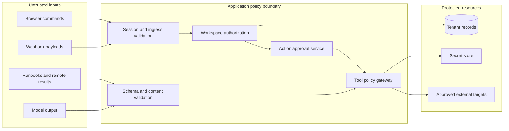

# Security and permissions

Status: proposed controls and acceptance criteria, 2026-10-02. These controls require implementation and verification before deployment.

Related: [data model](../architecture/DATA_MODEL.md), [API contracts](../architecture/API_CONTRACTS.md), [plugin system](PLUGIN_SYSTEM.md), [operational runbooks](../operations/OBSERVABILITY_AND_RUNBOOKS.md).

## 1. Assets and trust boundaries

Protect workspace data, production targets, connector credentials, approval decisions, source evidence, audit history, and user identity. An incident title, uploaded runbook, log line, model output, plugin manifest, or remote tool result may be attacker-controlled data.

MCP's security guidance addresses audience-bound authorization and unsafe destination requests. Apply those checks to every MCP adapter and its OAuth metadata flow; a successful protocol handshake does not grant application access. [MCP security guidance](https://modelcontextprotocol.io/docs/2026-07-28/tutorials/security/security_best_practices).

## 2. Human roles

Membership is scoped to a workspace and can contain several roles. Evaluate the operation's required permission explicitly. `admin` manages configuration; it does not imply the `commander` role.

| Operation | Viewer | Responder | Commander | Admin | Auditor |
|---|---|---|---|---|---|
| Read authorized incident/service views | Yes | Yes | Yes | Yes | Yes |
| Acknowledge, assign, comment, update incident | No | Yes | Yes | No | No |
| Request diagnosis or draft action | No | Yes | Yes | No | No |
| Approve/reject action | No | No | Independent only | No | No |
| Resolve incident | No | Yes | Yes | No | No |
| Upload candidate runbook versions | No | Yes | Yes | No | No |
| Publish a ready runbook version | No | No | Yes | No | No |
| Manage connector grants | No | No | No | Yes | No |
| Manage workspace membership | No | No | No | Yes | No |
| Stop incident action dispatch | No | No | Yes | Yes | No |
| Read full audit view | No | No | Yes | No | Yes |

Reading still applies document audience and data-classification rules. Any future audit-export endpoint must define its role, scope and retention policy before implementation. Permissions to update state match [API contracts](../architecture/API_CONTRACTS.md); a UI button is not an authorization boundary.

System workers use named service principals with purpose-specific permissions. A diagnostic worker can request evidence reads, while an action worker can dispatch a previously approved operation. Neither principal can create a human approval decision.

## 3. Authentication and browser sessions

- Use an OIDC provider with authorization-code flow and PKCE. Map the provider subject and issuer to an internal user; email is display/contact data, not the durable identity key.
- Keep application sessions on the server. Browser cookies are `HttpOnly`, `Secure`, and `SameSite=Lax` or stricter where the chosen login flow permits; rotate the session at sign-in and privilege changes.
- State-changing browser requests require CSRF validation plus origin checks. SameSite cookies alone are not the entire CSRF control.
- Use short idle and bounded absolute session lifetimes, selected with the deployment's identity policy. Approval requires recent authentication; use step-up MFA for production action approval.
- Derive workspace membership on the server from the session. Never accept actor ID, role, or workspace ownership from a request payload.
- Revalidate membership for each command and sensitive read. For an open SSE stream, revalidate periodically and close promptly on revocation; publish a revocation signal and enforce a maximum 30-second recheck interval.
- Return an indistinguishable not-found response when a cross-tenant entity ID is requested. Log the denial without exposing the foreign entity.

## 4. Tenant isolation

Every durable domain entity has `workspaceId`, except global catalog metadata. Require a typed `WorkspaceContext` at repository boundaries. Queries using entity IDs also require workspace filters; UUID unpredictability is not access control.

| Surface | Isolation rule |
|---|---|
| MongoDB | Compound tenant indexes, tenant-qualified reads/writes, and tested repository wrappers |
| Vector retrieval | Workspace/audience filtering inside the retrieval query and authorization before returning a source |
| Object storage | Workspace-scoped object keys; short-lived download URLs issued after authorization |
| Redis and BullMQ | Workspace in payload/cache key, verified again against durable records before execution |
| SSE | Cursor belongs to authenticated workspace; stream content rechecked before emission |
| Plugin installation | Workspace-scoped installation and grant; no global shared credential |
| AI and result caches | Workspace, model/prompt version, evidence checksums and access scope in cache identity |

Negative tests use the same incident, document, cursor, object, and installation identifiers under another workspace session. A forbidden request must neither read data nor enqueue work.

## 5. Immutable action approval

Action states are `proposed`, `awaiting_approval`, `approved`, `queued`, `executing`, `succeeded`, `failed`, `rejected`, `expired`, `cancelled`, and `outcome_unknown`.

1. A responder or commander requests a proposal. Persist the accountable human requester even when AI drafted it.
2. Freeze workspace, incident ID/generation, tool/version, canonical argument hash, target revision, remediation revision, risk summary, expected effect and expiry into an immutable specification.
3. Show the actual environment, target, payload, supporting evidence, alternatives, expiry and rollback conditions to the approver. Tooltips or hidden mobile columns cannot contain required decision information.
4. An independent commander approves or rejects. The requester cannot approve their own request, even if they hold several roles. A model or worker can never approve.
5. The specification and its approval binding expire 10 minutes after the proposal is issued; approval does not extend that deadline. Material diagnostic, target, or plan changes increment `remediationRevision`; comments do not. A mismatch requires a new proposal and approval.
6. Immediately before dispatch, revalidate the approver's active commander membership, requester membership, immutable spec hash, incident generation, target revision, remediation revision, expiry, installation grant and stop controls.
7. Atomically claim the approved action with a fencing token; create a durable attempt record before the external call. Carry the stable operation ID through the provider's idempotency interface.
8. A timed-out write becomes `outcome_unknown` when an external effect may have happened. Reconcile provider state or require an operator decision before another attempt; never blindly retry.

The MVP uses the same review experience for simulator actions. Production writes remain disabled until the dedicated milestone passes its gates. Production capabilities must be reversible and allowlisted. Rollback is a separately approved action; a previous approval does not authorize it.

Renew through `POST /api/v1/workspaces/{workspaceId}/actions/{id}/renew` with a fresh idempotency key and the old action's ETag. Fresh preflight creates a new action ID, immutable spec/hash and ten-minute expiry, records `supersedesActionId`, preserves `requestedBy` as the original human requester, and records `renewedBy` for the renewing human. No approval carries forward. For production, the new approver must differ from both the original requester and the renewal requester. Keep this independence rule across the renewal lineage; a series of renewals cannot erase who requested the action.

## 6. Approval race and recovery rules

| Race or failure | Required result |
|---|---|
| Two commanders approve concurrently | One transition wins version check; return current state to the other |
| Membership revoked after approval | Dispatch denied; preserve approval history |
| New material evidence after approval | Increment remediation revision; old action cannot dispatch |
| Commander renews another person's proposal | New proposal preserves original requester and renewal actor; renewing commander cannot approve their own renewal |
| Plugin version updated before dispatch | Approved version must still be available and permitted; otherwise re-propose |
| Stop control activated after queueing | Deny dispatch; audit reason and cancel safely |
| Stop activated after external request began | Attempt cancellation if supported; reconcile actual result |
| Worker lease expires during dispatch | Prevent another worker from assuming a retry is safe; reconcile attempt |
| Database unavailable after external success | Record pending recovery in operational telemetry; reconciler uses stable provider request/operation ID |
| Clock uncertainty threatens expiry | Fail closed for dispatch and alert operator; use server UTC |

An unavailable policy store blocks new sensitive dispatch. It does not turn a cached positive authorization into a permanent grant.

## 7. Input, evidence and model security

- Bound request and file size before parsing. Validate JSON against strict schemas, reject unexpected properties, normalize identifiers and use explicit enum values.
- Permit only parameterized log/metric query templates. Plugins cannot submit arbitrary shell commands, database queries, or user-supplied scripts.
- Treat external material as evidence. It cannot change roles, instructions, workflow limits, tool definitions or approval requirements.
- Redact secrets before ingestion, provider requests, tool output display and tracing. Preserve redaction markers so readers can see where context was removed.
- Detect common credential formats and allow project-specific sensitive-field patterns. Redaction is defense in depth; restrict source collection to necessary fields in the first place.
- Store safe excerpts and stable source IDs. A malicious source URL cannot cause automatic server fetches or a browser request to an arbitrary destination.
- Model-proposed arguments pass the same schema, target and permission checks as a manually created action. Unknown fields or invented tools fail closed.
- Prompt-injection classification is a signal, not the final security control. Independent enforcement continues even if the classifier misses the attack.

## 8. Credentials and network policy

Keep credentials in a deployment secret manager using envelope encryption or the manager's native protections. Mongo stores secret references and rotation metadata only. The worker receives narrowly scoped temporary credentials when available; values are excluded from browser responses, model context, fixtures, exceptions, telemetry and audit bodies.

Bind OAuth callbacks to the initiating session, installation, issuer, nonce/state, and exact redirect URI. Validate token issuer, audience and expiry. Do not pass a browser login token through to an unrelated connector. Record which approved secret version an invocation used without recording the secret.

Enforce egress allowlists outside the process as well as in URL validation. Include OAuth discovery endpoints and redirects. Production adapters use TLS with normal certificate validation; disallow options that skip verification. Isolate approved private-network connectors from general remote tool adapters.

Rotate credentials without updating model prompts. Revoke the old credential after the replacement has passed a harmless connectivity check. Suspected compromise immediately disables new dispatch and starts the incident procedure.

## 9. Audit, privacy and retention

Store actor, actor type, workspace, target, policy decision, reason code, operation ID, spec hash, prior/new state, server time, correlation ID and relevant versions. Do not store raw tokens, full prompt contents or unrestricted connector responses in audit records.

The domain transaction writes the incident/action change, durable `incident_timeline`, audit event, seven-day `workspace_events` entry and relevant outbox job together. Timeline and audit retention are 365 days. The short SSE replay window cannot replace durable history.

Production application roles cannot edit audit events. Export audit records to separately controlled immutable storage for tamper resistance; Mongo append-only conventions alone do not protect against privileged database administrators. Apply retention and legal-hold rules in the deployment policy before launch.

A deletion request revokes access immediately, then runs an auditable cleanup across documents, chunks, objects, caches, traces and provider-held artifacts where supported. Preserve only records justified by the documented retention policy. Keep analytics and evaluation datasets synthetic unless an explicit reviewed data-processing basis permits otherwise.

## 10. Required security verification

- Cross-workspace CRUD, search, SSE replay, signed-download and plugin invocation attempts all fail.
- A hostile runbook requesting secret export cannot broaden tools, egress or permissions.
- Replayed webhooks create no duplicate accepted event; invalid signatures enqueue no work.
- An approval cannot survive changed arguments, revoked membership, expiry, changed target or changed remediation revision; renewal cannot reset requester independence.
- Unknown external outcomes remain blocked pending reconciliation; duplicate queue delivery cannot create a second provider effect under the adapter contract.
- Secret canaries never appear in captured logs, model requests, traces, downloads or UI snapshots.
- Disabling a connector or activating stop controls prevents new dispatch and reports in-flight limitations accurately.
- Dependency/artifact review rejects unpinned or modified plugin releases; browser tests reject script-bearing widget content.

Track each gate in [test strategy](../engineering/TEST_STRATEGY.md). A failing isolation, approval or secret-handling test blocks production release.
