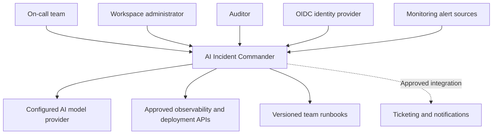
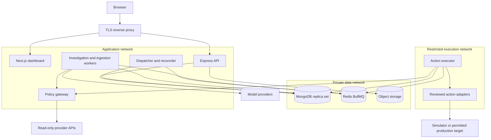
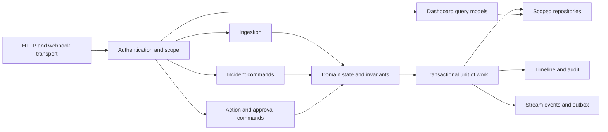
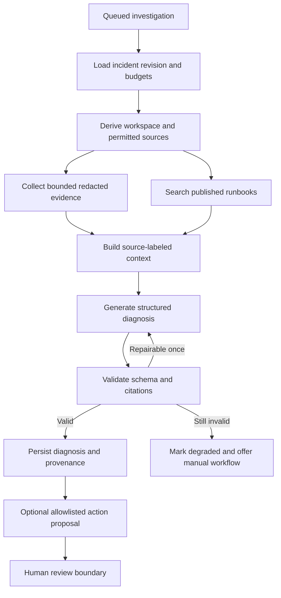
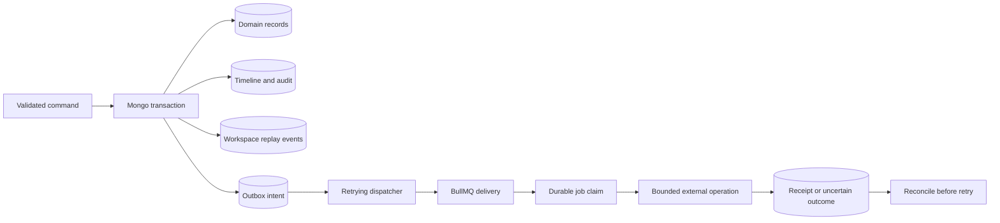
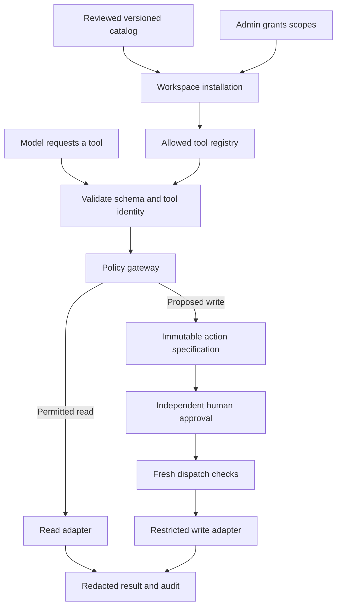
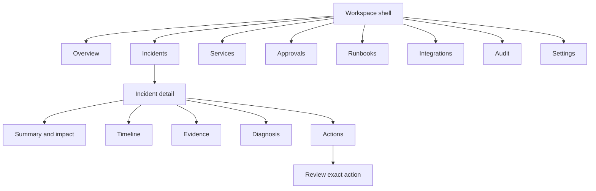

# Architecture diagram atlas

[Home](../../README.md) • Presentation-ready Mermaid sources

These diagrams describe the intended design. Solid arrows represent primary data/control flow; dotted arrows indicate optional or later capabilities. They do not imply every logical module runs as a separate service. Detailed algorithms live in [LLD](LLD.md) and [event flows](EVENT_FLOWS.md).

## 1. Product workflow

```mermaid
flowchart LR
  Alert[Alert received] --> Incident[Incident created or updated]
  Incident --> Owner[Responder acknowledges]
  Owner --> Evidence[Collect evidence and runbooks]
  Evidence --> Diagnosis[AI diagnosis with citations]
  Diagnosis --> Review[Human reviews proposal]
  Review -->|Approved and current| Execute[Execute permitted action]
  Review -->|Rejected or incomplete| Evidence
  Execute --> Verify[Verify observed recovery]
  Verify --> Monitor[Monitor service]
  Monitor --> Resolve[Human resolves incident]
  Resolve --> Learn[Review postmortem draft]
```

## 2. C4-style context

## 3. Container and network boundaries

## 4. Domain modules

## 5. Investigation and retrieval pipeline

## 6. Durable side-effect boundary

## 7. Plugin and permission boundary

## 8. Dashboard information architecture

Navigation labels and grouping are specified in [dashboard UX](../design/DASHBOARD_UX.md); adapt the shell without removing critical review context.

## 9. Delivery and release gates

```mermaid
flowchart LR
  Change[Scoped change] --> Static[Types and lint]
  Static --> Unit[Domain tests]
  Unit --> Contract[API and connector contracts]
  Contract --> Integration[Replica-set and queue tests]
  Integration --> Browser[Responsive and accessibility tests]
  Browser --> Eval[AI evaluation where changed]
  Eval --> Stage[Staging rehearsal]
  Stage --> Release[Versioned release]
  Release --> Observe[Observe SLOs and errors]
  Observe -->|Regression| Revert[Rollback compatible application version]
```

Only applicable suites run for a change; required release gates remain mandatory. Production database rollback is not assumed safe after a destructive schema change.

## 10. Diagram maintenance

Keep identifiers simple, quote labels containing parser-sensitive characters and avoid renderer-specific icons or C4 extensions. Every diagram has a text explanation in its owning design document. When a contract changes, update the diagram and its linked document together. Add alternative text or a nearby textual summary when exporting diagrams for a reader who cannot inspect them visually.
