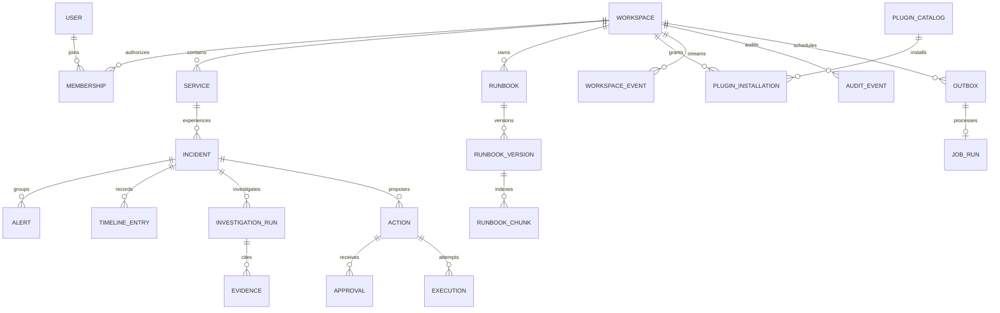

# Data model and storage contracts

[Home](../../README.md) • Normative storage baseline

## 1. Conventions

Public IDs are UUID strings. Timestamps are UTC BSON dates internally and ISO 8601 strings over HTTP. Every tenant record has `workspaceId`; global plugin catalog entries are the exception and contain no tenant secrets. `version` starts at 1 and changes through compare-and-set writes. Decimal stream sequence values serialize as strings to avoid integer precision assumptions.

MongoDB must be a replica set. Collection validation enforces required fields, types and enums; runtime validation is also required. Create indexes with named migrations before enabling traffic. No application query may infer workspace from a record ID alone.

## 2. Entity relationships



## 3. Collection definitions

All mutable records include `createdAt`, `updatedAt`, `version`; immutable records include `createdAt` and a schema version. Fields below are additional to `id` and `workspaceId` where applicable.

| Collection | Important fields | Constraints |
| --- | --- | --- |
| users | identityIssuer, identitySubject, displayName | Unique issuer+subject; avoid storing access tokens here |
| workspaces | name, status, policyVersion, region, retentionPolicy | status active/suspended/deleting; suspension denies new work |
| memberships | userId, roles[], status, grantVersion | Unique workspace+user; multi-role membership; revoked rows retained for attribution |
| services | slug, name, environments[], ownerTeam, criticality, dependencyIds[] | Unique workspace+slug; dependencies must belong to same workspace |
| connector_instances | pluginInstallationId, externalMapping, secretRef, status | Credentials are secret-manager references |
| alerts | connectorId, externalEventId, normalizedHash, serviceId, environment, fingerprint, severity, occurredAt, receivedAt, incidentId, summary, evidenceRefs[] | Unique exact source event; body bounded and redacted |
| incidents | serviceId, environment, fingerprint, active, generation, status, severity, title, ownerId, occurrenceCount, openedAt, acknowledgedAt, resolvedAt, remediationRevision, latestDiagnosisId | Active unique fingerprint; valid lifecycle; bounded arrays |
| incident_timeline | incidentId, streamSeq, eventType, actor, summary, refs[], causationId | Immutable history, separate from short replay retention |
| investigation_runs | incidentId, generation, inputRevision, state, rerunRequested, budget, providerProfile, promptVersion, checkpointRef, resultRef, leaseToken | state queued/running/completed/degraded/failed/cancelled; one active run per incident |
| diagnoses | runId, facts[], hypotheses[], missingEvidence[], proposedChecks[], evidenceIds[], validity, modelMetadata | Immutable; claims link source IDs; no generated approval flag |
| evidence | incidentId, runId, sourceType, sourceId, sourceVersion, collectedAt, observedFrom, observedTo, completeness, checksum, objectKey, redactedExcerpt | Scoped provenance; bounded excerpt and object permissions |
| actions | incidentId, spec, specHash, status, requestedBy, approvalId, executionKey, expiresAt, remediationRevision, version | Immutable spec; editable lifecycle only; no silent spec replacement |
| approvals | actionId, specHash, decision, decidedBy, decisionAt, reason, membershipVersion, policyVersion | Immutable decision; one accepted terminal review per proposal |
| executions | actionId, attempt, executionKey, connectorVersion, targetFence, dispatchAt, receipt, status, reconciliationState | Unique workspace+action+attempt; stable logical execution key |
| target_leases | serviceId, environment, holderActionId, fence, leaseUntil | Unique target; atomic compare-and-set renewals |
| runbooks | title, serviceIds[], environments[], activeVersionId, visibility, archivedAt | Active pointer changes only after ready-to-publish version |
| runbook_versions | runbookId, revision, artifactKey, checksum, authorId, state, extractorVersion, embeddingProfile | Immutable content; state uploading/indexing/ready/published/failed/withdrawn |
| runbook_chunks | versionId, ordinal, text, heading, page, offsets, embedding, embeddingProfile, published | Scope and publication filters checked during retrieval |
| plugin_catalog | pluginId, version, publisher, manifest, manifestHash, reviewStatus | Global; immutable version; no private connector configuration |
| plugin_installations | pluginId, pinnedVersion, grants[], status, policyVersion, configuredBy, health | Scoped installation; disabled means no future dispatch |
| idempotency_keys | subjectId, operation, key, requestHash, responseStatus, responseBody, expiresAt | Unique workspace+subject+operation+key |
| workspace_counters | nextSeq | One per workspace; transactionally incremented |
| workspace_events | streamSeq, eventType, entityType, entityId, entityVersion, occurredAt, causationId, expiresAt | Minimal invalidation; unique workspace+sequence |
| audit_events | actor, operation, resource, decision, reasonCode, requestId, specHash, beforeVersion, afterVersion, expiresAt | Append-only with restricted writers; no secrets/prompts |
| outbox | kind, aggregateId, schemaVersion, payloadRefs, state, leaseUntil, dispatchAttempt, nextAttemptAt, completedAt | Durable task intent; pending rows never expire |
| job_runs | outboxId, state, leaseToken, leaseUntil, attempt, resultRef, lastError, completedAt | Unique workspace+outbox; durable duplicate suppression |

## 4. Incident example

Illustrative identifiers are abbreviated for readability; actual APIs require UUIDs.

```json
{
  "id": "incident-uuid",
  "workspaceId": "workspace-uuid",
  "serviceId": "checkout-service-uuid",
  "environment": "demo",
  "fingerprint": "sha256:normalized-checkout-http5xx",
  "active": true,
  "generation": 1,
  "status": "investigating",
  "severity": "sev2",
  "title": "Checkout error rate increased after deployment",
  "ownerId": "responder-uuid",
  "occurrenceCount": 14,
  "version": 5,
  "remediationRevision": 2,
  "openedAt": "2026-10-02T14:30:00.000Z",
  "acknowledgedAt": "2026-10-02T14:31:00.000Z"
}
```

## 5. Action specification

```typescript
type ActionSpec = {
  workspaceId: string;
  incidentId: string;
  incidentGeneration: number;
  toolId: string;
  toolVersion: string;
  installationId: string;
  arguments: Record<string, unknown>;
  target: { serviceId: string; environment: string; revision: string };
  remediationRevision: number;
  expectedEffect: string;
  verification: { metric: string; operator: 'lt' | 'gt' | 'eq'; value: number; windowSeconds: number };
  rollbackProposalTemplateId?: string;
  expiresAt: string;
};
```

Canonicalize via one documented deterministic JSON algorithm: sort object keys, preserve arrays, forbid undefined/NaN/infinite numbers and normalize date formats. Hash the entire validated specification. Reviewers see the same canonical argument values; translating a display name must not change a hidden execution target.

Material plan/diagnostic/target changes increment `incidents.remediationRevision`. Comments, timestamps and read receipts do not. An approval is unusable when its bound generation or revision differs from the current incident.

## 6. Required indexes

| Collection | Index fields | Type / query served |
| --- | --- | --- |
| memberships | workspaceId, userId | Unique; request authorization |
| services | workspaceId, slug | Unique; catalog lookup |
| alerts | workspaceId, connectorId, externalEventId | Unique; webhook deduplication |
| alerts | workspaceId, incidentId, receivedAt desc, id desc | Timeline/evidence lookup |
| incidents | workspaceId, serviceId, environment, fingerprint | Unique partial filter `{active:true}` |
| incidents | workspaceId, status, severity, updatedAt desc, id desc | Default incident queue; verify sort plan |
| incidents | workspaceId, ownerId, active, updatedAt desc, id desc | My active incidents |
| incident_timeline | workspaceId, incidentId, streamSeq | Unique; history cursor |
| investigation_runs | workspaceId, incidentId | Unique partial filter `{active:true}`; store derived active flag |
| actions | workspaceId, status, expiresAt, id | Approval queue/expiry scans |
| approvals | workspaceId, actionId | Unique; prevents competing terminal decisions |
| executions | workspaceId, actionId, attempt | Unique; attempt record |
| target_leases | workspaceId, serviceId, environment | Unique; target serialization |
| runbook_versions | workspaceId, runbookId, revision | Unique; immutable version lookup |
| runbook_chunks | workspaceId, versionId, ordinal | Unique; source citation |
| plugin_catalog | pluginId, version | Unique global version |
| plugin_installations | workspaceId, pluginId | Unique v1 installation per plugin |
| workspace_events | workspaceId, streamSeq | Unique; stream replay |
| outbox | state, nextAttemptAt, leaseUntil | Dispatcher scan; workspace fairness applied in scheduler |
| job_runs | workspaceId, outboxId | Unique; durable job identity |
| audit_events | workspaceId, createdAt desc, id desc | Audit pagination |

Also add unique `id` indexes where `_id` is not the public ID, and TTL indexes on designated expiry fields. TTL deletion is asynchronous; authorization and expiry decisions compare timestamps explicitly. Do not use a TTL index as the action approval validator.

## 7. Retrieval index

Atlas vector index contains an embedding vector plus filter fields for workspace, publication, runbook version, service scope and environment scope. Query must constrain workspace and publication before accepting results. Recheck active-version visibility against authoritative metadata to protect against index lag or withdrawn content. If a backend cannot enforce scope, do not use it.

Lexical local search obeys the same contract and is visibly identified as lexical mode. Similarity scores are retrieval scores, not probabilities that an incident diagnosis is correct. Store embedding profile and dimension with the index; regenerate on profile changes.

## 8. Retention defaults

| Data | Default | Cleanup behavior |
| --- | --- | --- |
| Alerts and raw redacted evidence | 30 days | Keep summary/provenance needed by retained incident; expired evidence explicitly unavailable |
| Workspace SSE events | 7 days | Older cursors require snapshot resync |
| Incident metadata and timeline | 365 days after resolution | Active incidents never removed by age alone |
| Audit, action specifications, decisions and receipts | 365 days | Restricted append access; archive/export before policy expiry if required |
| Graph checkpoints | 30 days after run terminal | Keep diagnosis and essential provenance separately |
| Completed outbox rows | 7 days after completion | Never expire incomplete intent |
| Completed job_runs | 90 days | Reject jobs whose outbox intent no longer exists; retained action records remain dedup authority |
| Command idempotency responses | 24 hours | An action's state and approval uniqueness still prevent repeated execution after key expiry |
| Published runbooks | Until withdrawn/replaced retention ends | Revoke search visibility immediately, then clean index/artifacts |
| Secrets | Until grant revoked or rotated | Revoke provider access and remove secret references according to provider policy |

Deletion of a workspace first disables ingestion, sessions, jobs and grants; then revokes external credentials; then removes/redacts tenant content according to retention obligations. A deletion ledger records completion without retaining user content. Backups age out on their documented schedule, and restored backups must reapply deletion tombstones before serving traffic.

## 9. Migration rules

Use expand → deploy compatible readers/writers → backfill → verify → contract. Every migration is idempotent and resumable, has a batch size and supports dry-run counts. New uniqueness constraints require duplicate reconciliation before index creation. Test mixed application versions during rolling deployment.

Mongo transactions do not cover object storage or provider APIs. Use staged object keys, checksums, publish pointers and orphan cleanup; preserve old references until migration validation succeeds.
