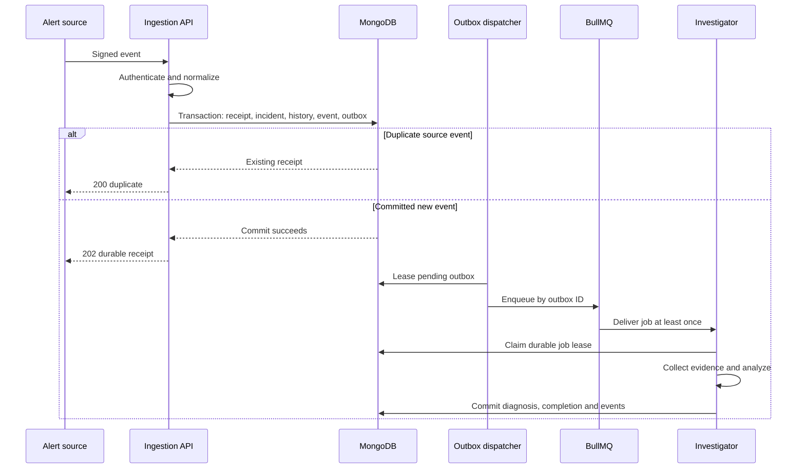
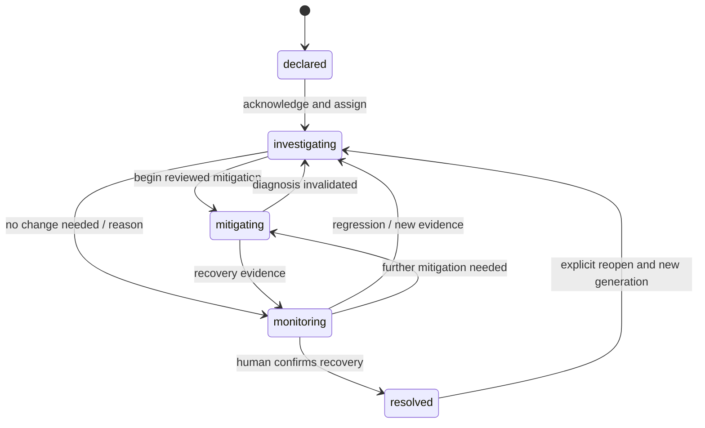
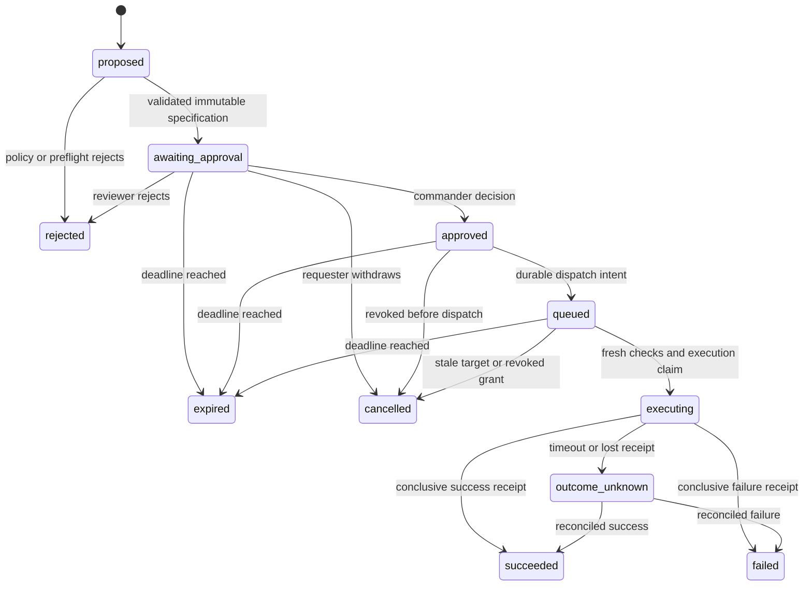
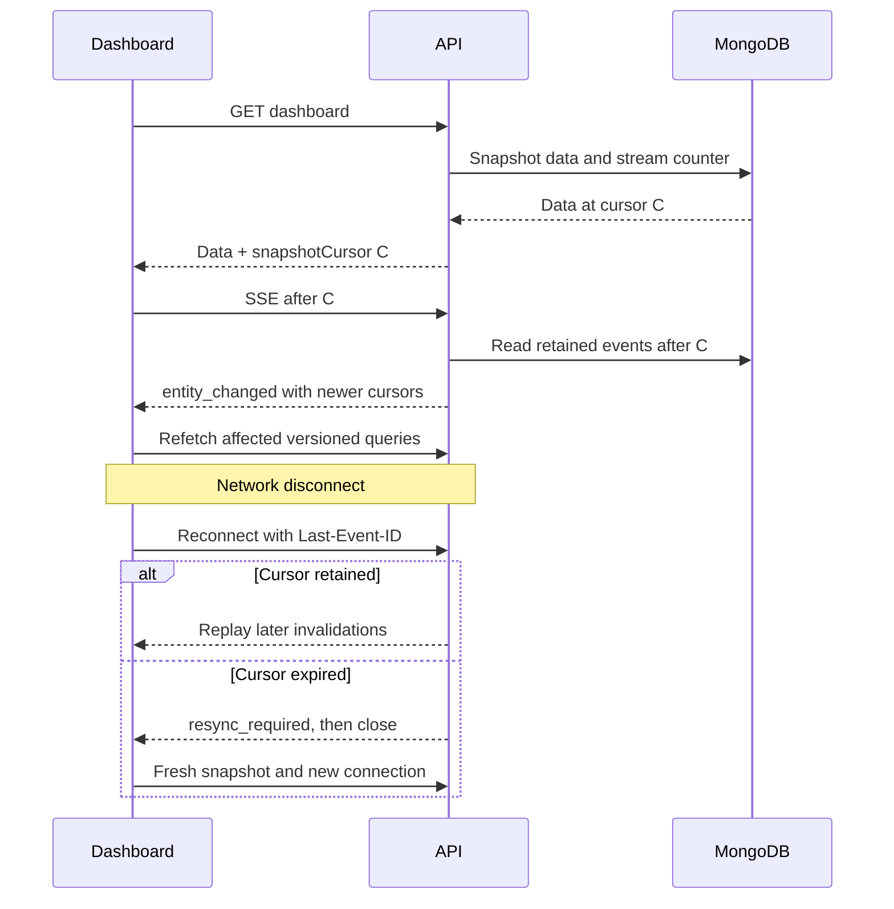

# Events, state machines and failure sequences

[Home](../../README.md) • [API](API_CONTRACTS.md) • [Data model](DATA_MODEL.md)

## 1. Event envelope

```typescript
type DomainEvent = {
  eventId: string;
  schemaVersion: 1;
  workspaceId: string;
  streamSeq: string;
  type: string;
  aggregateType: string;
  aggregateId: string;
  aggregateVersion: number;
  occurredAt: string;
  actor: { type: 'user' | 'service'; id: string };
  causationId: string;
  correlationId: string;
  payload: Record<string, unknown>;
};
```

`eventId` identifies one occurrence; `causationId` identifies the command/job that caused it; `correlationId` groups a workflow. A transaction may generate multiple events and must allocate their sequence values atomically. A browser receives a reduced invalidation representation. Sensitive domain payloads are never copied wholesale into SSE.

## 2. Event registry

| Event | Producer | Durable effect / consumer |
| --- | --- | --- |
| alert.accepted | Ingestion | Alert receipt, incident count, optional investigation intent |
| incident.created | Incident service | Timeline, audit, dashboard invalidation |
| incident.acknowledged | Incident service | Owner and investigating status |
| incident.transitioned | Incident service | Validated lifecycle transition |
| investigation.requested | Investigation service | Outbox job; latest input revision |
| investigation.completed | Worker | Immutable diagnosis and evidence links |
| investigation.degraded | Worker | Partial result and missing-source details |
| action.proposed | Action service | Immutable specification and expiry |
| action.decided | Approval service | Decision and dispatch intent if approved |
| action.dispatched | Executor | Attempt record with stable execution key |
| action.completed | Executor/reconciler | Conclusive outcome and receipt |
| action.outcome_unknown | Executor | Reconciliation intent; no blind retry |
| plugin.revoked | Integration service | Deny future dispatch; invalidate health/settings |
| runbook.published | Knowledge service | Active version pointer and retrieval invalidation |

Every new event type requires a schema, owner, retention, redaction rule and replay compatibility decision. Notification consumers deduplicate by event ID and channel; an incident replay must not resend historical notifications accidentally.

## 3. Alert ingestion sequence



Failure before commit receives a retryable response and no acceptance guarantee. Failure after commit but before HTTP response is recovered by the exact source-event duplicate key. Failure after queue enqueue but before marking dispatch may cause duplicate jobs; the durable job claim handles them.

## 4. Incident state machine



An upstream resolved alert does not automatically resolve the incident. Reopen rejects a collision with an already active incident sharing the correlation key. Invalid transitions return 409; stale aggregate versions return 412.

## 5. Action state machine



Approved and queued may be recorded in the same transaction with one externally visible queued result. `succeeded` means the connector operation completed; incident recovery requires separate verification. Renewal creates a new proposal. A failed or unknown action is not moved back to queued automatically. If reconciliation proves no effect occurred, a new authorized attempt is an explicit policy-controlled command.

## 6. Approval and execution sequence

```mermaid
sequenceDiagram
  participant Human as Commander
  participant API as Approval API
  participant DB as MongoDB
  participant Exec as Executor
  participant Gate as Policy gateway
  participant Tool as Connector
  Human->>API: Decision + specHash + If-Match
  API->>DB: Verify actor, proposal and expiry
  API->>DB: Transaction: approval, action, audit, outbox
  API-->>Human: Decision accepted; queued
  Exec->>DB: Reload current policy and approval
  Exec->>Gate: Preflight target and permissions
  Gate-->>Exec: Current target revision
  Exec->>DB: Claim target lease and execution record
  Exec->>Tool: Execute using stable executionKey
  alt Conclusive result
    Tool-->>Exec: Receipt
    Exec->>DB: Store outcome and verification intent
  else Ambiguous timeout
    Exec->>DB: outcome_unknown and reconcile intent
    Exec->>Tool: Query receipt or target state
    Tool-->>Exec: Reconciliation evidence
    Exec->>DB: Record known outcome or require manual review
  end
```

A revocation arriving before the final dispatch check prevents dispatch. A revocation racing after a remote request was sent cannot retract it; surface the in-flight state and reconcile. Killing a worker is not a rollback mechanism.

## 7. Snapshot and stream sequence



## 8. Replay rules

- Browser replay is read-only and cannot trigger domain commands.
- Queue replay requires a still-valid durable intent and current authorization.
- Audit export preserves original timestamps and actor IDs.
- Graph checkpoint replay can repeat work before a checkpoint; external writes remain outside model-controlled graph nodes.
- Projection rebuilds use a defined event schema/version and a separate rebuild identity. Never treat a replayed event as permission to send a message or execute an action.

See [operations](../operations/OBSERVABILITY_AND_RUNBOOKS.md) for recovery procedures.
