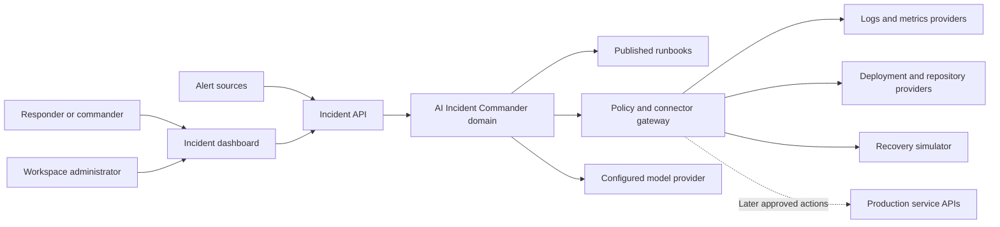
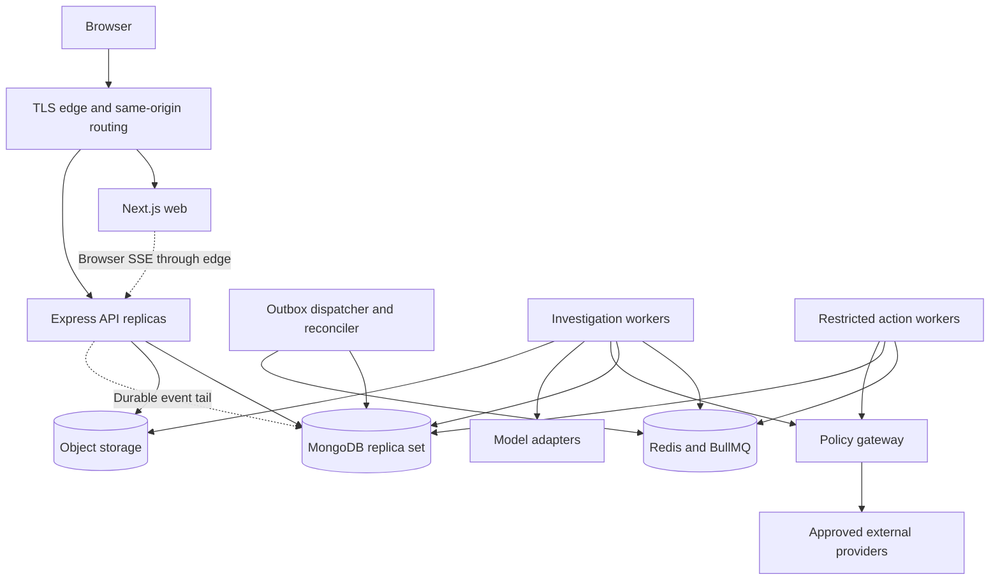

# High-level design

[Home](../../README.md) • [System design](SYSTEM_DESIGN.md) • [LLD](LLD.md)

## 1. System context

### Trust boundaries

The public edge accepts browser and signed connector traffic. The application network contains the API and workers. The data network contains MongoDB, Redis and object storage. Provider APIs are external and cannot be trusted to respond promptly, truthfully or exactly once. The execution workload has narrower network egress and separate credentials from investigation workers.

## 2. Logical components

| Component | Owns | Does not own |
| --- | --- | --- |
| Web app | Navigation, presentation, client cache, review UI | Authorization decisions, connector secrets |
| Auth module | Session, membership, role resolution | Domain status transitions |
| Ingestion module | Webhook authenticity, normalization, duplicate receipts | Probabilistic correlation |
| Incident module | State, ownership, severity and correlation | Direct remote infrastructure calls |
| Evidence module | Provenance, redaction, bounded evidence retrieval | Full log indexing |
| Knowledge module | Runbook versions, publication and search | Unreviewed automatic runbook publication |
| Investigation module | Durable run orchestration and diagnosis schema | Approval authority |
| Action module | Proposals, approvals, expiry and execution records | Trusting an LLM-generated permission decision |
| Integration module | Catalog, tenant installations, grants and health | Global implicit access after installation |
| Event module | Timeline, audit, outbox and replay | Inferring state from browser caches |
| Reporting module | Postmortem drafts and aggregate read models | Rewriting historical audit records |

Module writes happen through application services. A module may read another module's public repository interface but cannot mutate its collections directly. Shared packages contain domain types, schemas, errors and policy helpers, not a circular network of service imports.

## 3. Deployment containers

The gateway is an internal module plus adapter workers in MVP, with its own process when network isolation is introduced. Diagrams express logical boundaries even if components initially run in the same deployment. No browser connects directly to MongoDB, Redis or the model provider.

## 4. End-to-end responsibilities

### Alert to incident

1. Authenticate connector, limit payload and validate source schema.
2. Resolve tenant, service, environment and fingerprint from trusted mappings.
3. Insert alert or return its duplicate receipt.
4. Atomically find/create the active incident, append history and create investigation intent if needed.
5. Commit; return 202 and stable receipt IDs.
6. Dispatcher schedules background analysis; dashboard receives an invalidation.

### Diagnosis to recovery

1. Worker reads an authorized incident snapshot.
2. Gateway collects bounded evidence and runbook passages.
3. Model outputs a structured diagnosis; server validates provenance and schema.
4. Proposal service validates an allowlisted action definition and freezes its specification.
5. Commander reviews and approves a specific hash before expiry.
6. Executor revalidates policy and target, claims an execution record and dispatches once logically.
7. Provider receipt and observed verification are stored; uncertainty enters reconciliation.
8. Human monitors and resolves the incident.

## 5. Internal interfaces

- Commands: typed service methods with `ActorContext`, workspace scope, expected version and idempotency key.
- Reads: paginated query services returning DTOs and versions, never raw database documents.
- Jobs: versioned envelopes containing IDs and hashes; workers reload sensitive state and permissions.
- Events: immutable business events and minimal browser invalidations sharing a causation ID.
- Plugins: typed adapter or MCP tool calls with input/output schema, timeout, capability and grant checks.
- Models: normalized structured request/response with token and time budgets; credentials injected server-side.

## 6. Availability and scale boundaries

Scale API by request rate and SSE connections; investigators by oldest eligible job age and model quota; executors conservatively by allowed target concurrency. Only one action may execute against the same workspace/service/environment target at a time. Action locking uses durable leases with fencing tokens; external connectors also need idempotency or reconciliation.

Queues separate `investigations`, `knowledge`, `actions`, `reconciliation` and `notifications`. A delayed provider cannot monopolize all work. Public ingestion is isolated from large upload and export endpoints with separate limits.

At baseline, MongoDB snapshot/transaction contention and indexes are more important than adding services. Use the capacity assumptions in [system design](SYSTEM_DESIGN.md) as load-test inputs before setting autoscaling thresholds.

## 7. Data lifecycle

Raw telemetry stays in upstream systems. Redacted evidence is persisted with source/version/time metadata and bounded object size. Runbook artifacts are immutable; publishing a new version changes the active pointer after indexing succeeds. Deletion revokes retrieval visibility immediately and schedules storage cleanup.

`workspace_events` expires after seven days. `incident_timeline` preserves incident history for 365 days by default and is written in the same transaction; timeline queries do not depend on replay retention. Audit records also default to 365 days. Tenant policy and deletion workflows may shorten retention where appropriate; legal and contractual requirements require separate review.

## 8. Integration phases

1. Synthetic alerts, simulator, local runbooks and deterministic model fixture.
2. A real model provider, read-only metrics/logs and deployment history.
3. Ticket/comment or notification connectors with explicit send permissions.
4. One reviewed reversible production action connector.

The application can be built with Codex, Claude Code or another coding assistant. See [agent compatibility](../ai/AGENT_COMPATIBILITY.md). An assistant plugin and a deployed application connector are independently configured.

## 9. HLD review gate

- Boundaries have owners and no browser/server secret overlap.
- Every durable write has transaction, retry and duplicate behavior.
- Every external write has approval, reconciliation and cancellation semantics.
- Every user journey has a degraded mode and a mobile layout.
- Deployment and recovery targets have an executable validation plan.

Detailed schemas and sequences are normative in [data model](DATA_MODEL.md), [API contracts](API_CONTRACTS.md) and [event flows](EVENT_FLOWS.md).
