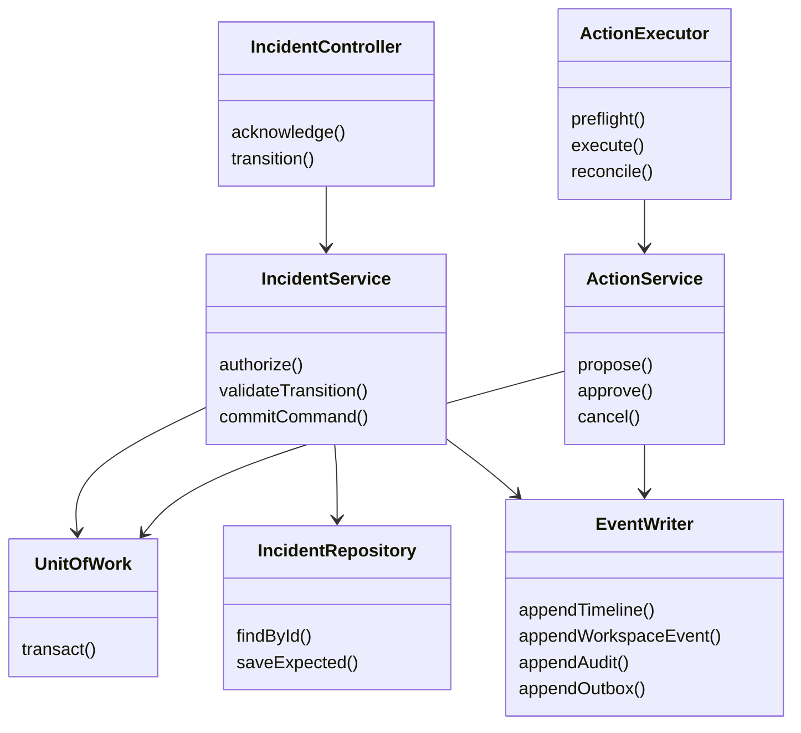

# Low-level design

[Home](../../README.md) • [HLD](HLD.md) • [Data model](DATA_MODEL.md)

## 1. Proposed repository layout

The paths below are future implementation targets, not existing executable files.

```text
apps/
  web/                  Next.js routes, client interactions, accessible UI
  api/                  Express transport, middleware, dependency wiring
  worker/               Dispatcher, investigator, knowledge and notification jobs
  executor/             Restricted action and reconciliation jobs
packages/
  contracts/            Runtime schemas, DTOs, event and error definitions
  domain/               Aggregates, state machines and invariant checks
  application/          Command/query handlers and ports
  persistence/          Mongo repositories, transactions and outbox
  auth/                 Session and policy adapters
  ai/                   LangChain/LangGraph orchestration and model adapters
  connectors/           Reviewed connector implementations and MCP gateway
  ui/                   Tokens, primitives and shared dashboard components
  observability/        Logging, metrics, traces and redaction
  test-fixtures/        Synthetic alerts, simulator and adversarial evidence
infra/                  Compose and hosted deployment definitions
```

Dependency direction: transport → application → domain/contracts. Persistence, models and connectors implement application ports. Domain code does not import Express, React, Mongo drivers or a provider SDK. UI consumes public contract types, never server repositories.

## 2. Core interfaces

Illustrative TypeScript contracts; implementation must supply runtime validation at each external boundary.

```typescript
type ActorContext = {
  subjectId: string;
  workspaceId: string;
  roles: Array<'viewer' | 'responder' | 'commander' | 'admin' | 'auditor'>;
  requestId: string;
  sessionId?: string;
};

type CommandMeta = {
  idempotencyKey: string;
  expectedVersion?: number; // required for commands on existing aggregates
};

interface IncidentService {
  acknowledge(ctx: ActorContext, id: string, meta: CommandMeta): Promise<IncidentDTO>;
  transition(ctx: ActorContext, id: string, input: TransitionInput,
             meta: CommandMeta): Promise<IncidentDTO>;
}

interface ScopedIncidentRepository {
  findById(workspaceId: string, id: string, tx?: Transaction): Promise<Incident | null>;
  saveExpected(incident: Incident, expectedVersion: number, tx: Transaction): Promise<void>;
}

interface ActionConnector {
  preflight(ctx: ToolContext, spec: ActionSpec): Promise<PreflightResult>;
  execute(ctx: ToolContext, spec: ActionSpec, executionKey: string): Promise<ExecutionReceipt>;
  reconcile(ctx: ToolContext, executionKey: string): Promise<ReconciliationResult>;
}
```

`Transaction` is an internal abstraction over one database session. Repository constructors must not provide an unscoped generic `findById(id)` to application code. Model and connector output fields are parsed as data, never executed as source code.

## 3. Class relationships



## 4. Command transaction algorithm

1. Validate path/body/header schemas and authenticate the actor.
2. Compute a canonical request hash including workspace, subject, route and normalized body.
3. In a transaction, find the scoped idempotency record; return the saved response if the hash matches, or 409 if it differs.
4. Read current membership and domain record. Verify role, state and expected version.
5. Apply the pure domain transition; increment `version` once. Increment `remediationRevision` only for material diagnosis/target/plan changes.
6. Allocate the next workspace stream sequence and insert the domain record, timeline entry, browser event, audit and any outbox intent.
7. Save the successful response in the idempotency record and commit.
8. Publish a best-effort wake-up hint; the durable event poller remains sufficient without it.

Use bounded transaction retry for transient errors. Never call a model, connector or object storage inside this transaction. An ambiguous commit result is resolved by reading the command key before applying again. An insert race on the same idempotency key re-reads its committed result.

## 5. Alert correlation algorithm

Validate a maximum 256 KiB request body, normalize timestamps, accept only known connector mappings and calculate a stable fingerprint from alert type and selected labels. Drop volatile values such as current latency, pod instance ID and receipt time from the fingerprint unless the source mapping explicitly defines their identity role.

Within a transaction, insert the exact event receipt; find the matching active incident; create one if absent; increment occurrence count and `lastAlertAt`. The active partial unique index prevents parallel creators. On that conflict, abort and retry attaching to the winner. Source events with the same ID but different normalized content return 409 and are investigated as connector inconsistency.

Create a new investigation intent only if no compatible run is queued/running and the incident changed materially. While one run is active, set `rerunRequested=true` and coalesce subsequent changes. At completion, the worker checks this flag and the latest revision, then schedules at most one follow-up.

## 6. Worker execution

Job payload: `{schemaVersion, outboxId, workspaceId, kind, aggregateId, expectedRevision, requestId}`. Secrets and full evidence never enter Redis payloads.

1. Reload outbox intent and aggregate; reject a job whose durable intent is absent, cancelled or completed.
2. Atomically claim a `job_runs` lease using database time and increment a fencing token.
3. Check workspace policy, quotas and whether the expected revision is still useful.
4. Execute bounded work outside transactions. Persist progress checkpoints with the current fencing token.
5. Commit result, completion and resulting events/outbox rows using a compare-and-set on the lease token.
6. Acknowledge queue completion; if that fails, duplicate delivery observes durable completion.

Default proposal: 60-second lease, renewal every 15 seconds, provider request timeout 30 seconds and overall investigation budget 90 seconds. The first useful diagnosis target is 45 seconds. A worker that loses its lease must stop; fencing prevents stale database writes. External side effects require connector idempotency even when a lease exists.

Read-only jobs retry at most three times with exponential backoff and jitter, subject to a total budget. Parsing/policy errors fail immediately. Production writes are never covered by a generic retry wrapper.

## 7. Approval and dispatch protocol

Freeze an action specification containing workspace, incident, tool ID and version, canonical arguments, target ID/revision, current `remediationRevision`, expected effect, verification conditions and expiry. Compute `specHash` over canonical serialized fields. Display the same fields to the reviewer.

Approval transaction verifies commander membership, independent reviewer rules, action version/hash and expiry. It inserts an immutable decision, advances the action and creates dispatch intent. Any action edit creates a new proposal; it cannot preserve the old approval.

At dispatch, preflight re-reads membership, current grant, connector version, kill switch, target revision and remediation revision. An expired/stale/revoked proposal is not executed. Allocate a stable `executionKey` from the action ID; claim the target lease and execution record. Mark the action `executing` before the remote call. Once dispatch has begun, cancellation cannot promise that the external change was prevented.

Record a conclusive receipt as succeeded/failed according to the connector contract. A transport timeout, crash after dispatch or ambiguous result becomes `outcome_unknown`. Reconciliation queries remote state and records evidence; only a confirmed absence plus still-valid authorization can permit a retry. Rollback creates a separate action and approval.

## 8. Knowledge ingestion

Upload → quarantine → file/type/size validation → malware/content inspection where supported → extraction → redaction → chunking → embedding → index readiness check → publish pointer. Until the final publication transaction, the prior runbook version remains active.

Proposed limits: Markdown/text/PDF up to 10 MiB and 100 pages; reject encrypted or unsupported files with clear feedback. Chunk by heading and paragraphs, start at roughly 600 tokens with 80-token overlap, and tune on evaluation. Store precise source offsets/page numbers. Vector dimension and embedding provider/version are index metadata; changing them requires reindexing, not mixing incompatible vectors.

## 9. API validation and error handling

- UUID identifiers, ISO 8601 UTC timestamps, bounded text lengths and enumerated states.
- Parameterized Mongo filters; never merge arbitrary user JSON into operators.
- Allowlisted sort/filter fields and opaque cursor pagination.
- Typed errors map to the [API error codes](API_CONTRACTS.md); no stack traces or secret-bearing provider errors in responses.
- Logs contain request, workspace, incident and job IDs; avoid prompt/evidence content by default.
- Command handlers return authoritative results; the UI reconciles cache after success or conflict.

## 10. Extensibility and test seams

Inject a clock, UUID generator, model adapter, object store, connector and queue port. Pure state machines and hash canonicalization are unit tested. Transaction/race tests run against a replica set, queue tests against Redis, and connector uncertainty tests against a fault-injecting fake provider. A deterministic simulator exposes preflight, execute, receipt lookup and verification, so failure paths can be reproduced in CI.

See [test strategy](../engineering/TEST_STRATEGY.md) for mandatory cases and [plugin system](../ai/PLUGIN_SYSTEM.md) for adapter registration.
