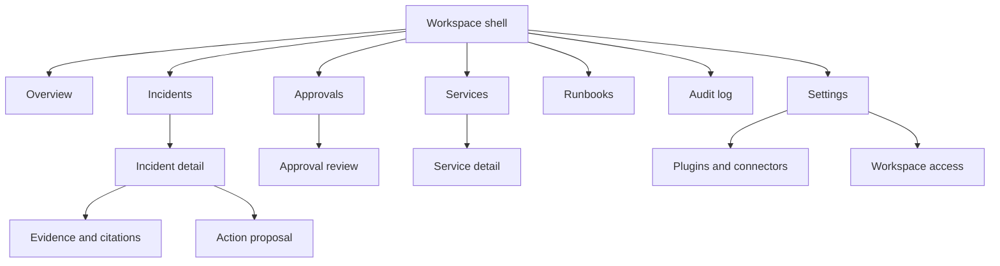
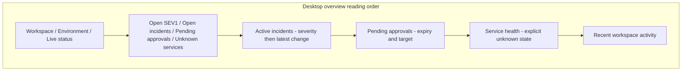
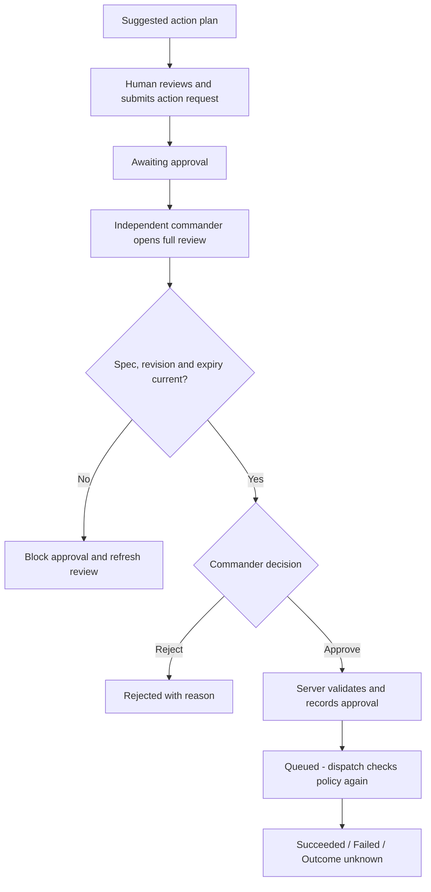

# Dashboard UX and Screen Specifications

Status: proposed UX, 2026-10-02. This is the screen and interaction contract for the MVP and explicitly marked later production capabilities. See [Requirements](../product/REQUIREMENTS.md) and [UI system](UI_DESIGN_SYSTEM.md).

## 1. Information architecture

The MVP exposes one workspace while retaining workspace identity in routes, requests, and permissions. The environment selector is a filter, not a permission grant. Display the workspace and environment on every action review.

Primary navigation order: Overview, Incidents, Services, Approvals, Runbooks, Audit log. Settings and Help sit at the bottom of the desktop sidebar and in the mobile menu. Show only destinations the user can access; if a deep link is forbidden, display a clear permission page without leaking entity data.

| Destination / operation | Required active workspace role |
|---|---|
| Overview, incident/service detail, published runbooks, action detail | Any read-capable member, including admin and auditor |
| Acknowledge, assign, diagnose, request action, transition and resolve incident | Responder or commander |
| Approvals queue and Audit log | Commander or auditor; auditor remains read-only |
| Approve/reject action; publish ready runbook version | Commander, with independent-review policy enforced |
| Create/upload runbook and renew action review | Responder or commander |
| Plugin settings, service catalog editing, workspace access | Admin |

Roles may be combined. Admin alone cannot acknowledge, resolve, or approve. The desktop sidebar, tablet rail, and compact menu use identical labels, ordering, and permission filtering. Unknown/cross-workspace deep links use the API's uniform unavailable page; a known operation denied to a current member may explain the missing capability.

## 2. Shell and route map

The paths below are proposed browser routes, not additional API routes. Use a stable workspace slug or ID mapped to the authorized workspace.

| Browser route | Purpose | Essential controls |
|---|---|---|
| `/w/:workspace/overview` | Current incident load and service health | Environment, time range, freshness |
| `/w/:workspace/incidents` | Triage queue | Search, severity/state/service/owner filters, sort |
| `/w/:workspace/incidents/:id` | Investigation workspace | Acknowledge, assign, state change, evidence, proposals |
| `/w/:workspace/services` | Service inventory and health | Search, environment, status, owner |
| `/w/:workspace/services/:id` | Service context and related incidents | Health samples, dependencies, runbooks |
| `/w/:workspace/approvals` | Pending and historical action requests | Status, requester, expiry, environment |
| `/w/:workspace/approvals/:id` | Full action review | Scope, revision, evidence, approve/reject |
| `/w/:workspace/runbooks` | Evidence knowledge base | Upload, ingestion status, source version |
| `/w/:workspace/audit` | Authorized activity record | Actor, event type, time range, entity |
| `/w/:workspace/settings/plugins` | Installed integrations and scopes | Capability review, configure, test, disable |

Header contains current breadcrumb, live connection status, Help, and account menu. Search has a visible input on wide screens and a labeled button opening search on smaller screens. MVP search covers authorized incidents and services; label its scope. Do not show a nonfunctional command palette.

## 3. Overview wireframe and hierarchy

Desktop places active incidents across eight of twelve content columns and approval summaries across four; health and activity follow. DOM order matches the diagram so the narrow layout remains coherent. Metrics are links to lists with the corresponding filters. Show at most four summary metrics; every metric includes the active scope and updated time. Approval queue widgets and their links appear only for commanders/auditors; for other roles the incident region expands. Restricted counters are omitted rather than shown as zero.

Do not imply that lack of alerts proves a service is healthy. Service health distinguishes observed healthy, degraded, unhealthy, and unknown. Until real health ingestion exists, demo cards show “Simulated health.”

## 4. Incidents list and triage

- Default view: active incidents, severity ascending from SEV1, then latest update descending; resolved incidents are available through an explicit state filter.
- URL stores selected filters and sort. Provide “Clear filters” and a result count. Browser Back restores filters, page cursor, and the originating row position.
- Desktop table columns: severity, title, service/environment, state, owner, updated time. At narrow widths use the card specification in [Responsive rules](RESPONSIVE_RULES.md).
- Acknowledge is available to an authorized responder or commander; it assigns the actor and moves `declared` to `investigating`. Do not label this operation “Resolve.”
- No bulk approvals or bulk production writes. Bulk list selection is deferred until a specific safe use case exists.
- Empty workspace: “No incidents yet. Send a sample alert to try the workflow.” Only permitted users see the sample-alert action.
- Filtered empty: “No incidents match these filters.” Retain filters and offer “Clear filters.”
- Row changes preserve keyboard focus and reading position. Announce a summary of updates and provide “Apply updates.”

## 5. Incident detail

Header: incident reference and title, severity, lifecycle state, service, environment, assigned responder, declared time, latest update, and connection freshness. The production/simulation label remains visible near all action controls.

| Area | Content | Interaction |
|---|---|---|
| Summary | Impact, affected service, current owner, latest confirmed facts | Editable only through permitted commands with version checks |
| Timeline | Alerts, assignments, comments, diagnoses, approvals, execution outcomes | Newest/oldest preference; explicit “Follow latest”; filters never hide execution outcomes without a visible filter indicator |
| Evidence | Redacted logs, metrics, runbook passages, source dates | Citation opens exact source/version and relevant excerpt; failed source remains marked unavailable |
| Diagnosis | Hypotheses, supporting/contradicting evidence, known gaps | Generate diagnosis where permitted; active runs coalesce; no fabricated percent confidence |
| Action plans | Suggested tool, target, arguments, rationale, expected effect; submitted proposals show immutable spec | Review suggestion, submit an action request, then track the immutable proposal and result |
| Related context | Service ownership, dependencies, related incidents | Explicit links; dependency absence says “No dependencies recorded” |

Desktop may show a main investigation column and a 360 px context column. At smaller widths the context follows the main summary. Evidence and approval reviews use dedicated routes so deep links, browser history, and mobile navigation remain reliable.

State changes use canonical values: declared → investigating → mitigating → monitoring → resolved. The server validates permitted transitions, including investigation-to-monitoring when no mitigation is needed and regressions back to investigation. Responders and commanders can resolve from monitoring with a reason and recovery evidence. The UI never invents an “acknowledged” lifecycle value. Reopening a resolved incident follows the new-generation behavior in [LLD](../architecture/LLD.md).

## 6. Approval flow

MVP requests execute only against the simulator. Production execution is a later milestone and must retain the independent-commander rule and policy gateway.

Submitting the reviewed suggestion calls the action-creation command; the server records a new immutable proposal and moves it into review after preflight. The review page displays original requester, renewal requester when present, approver requirements, incident/environment, exact tool and version, canonical target, argument diff, expected effect, risk notes, citations, rollback proposal if available, expiry time, and immutable spec fingerprint. Show readable arguments by default and an optional raw JSON section. A fingerprint alone is insufficient review context.

Require an explicit acknowledgement of the reviewed environment and target, then a button labeled with the action: “Approve simulated restart” or “Approve production restart.” Do not require copying a target string, a timed gesture, or holding a button. The original requester and any renewal requester cannot approve their own production request; the simulator follows the same independent-review experience. An admin role alone cannot approve.

- Enter in a text field must not approve. The approval button requires deliberate activation after the full review loads.
- Begin with no affirmative button focused. On mobile place the review in one column with the final controls after the content; a sticky footer may link to “Review decision” but must not bypass it.
- Re-fetch the request and permissions before enabling a decision. A new material revision, expired spec, revoked grant, or kill switch disables submission and names the reason.
- Count down visually without announcing every second. At expiry keep the review readable and offer “Renew review” to a responder/commander. Renewal creates a fresh action ID/spec/expiry, preserves original requester attribution, records the renewal requester, and supersedes the old pre-dispatch proposal. Neither requester may approve the production renewal. Existing approval never transfers.
- On slow submission, keep controls disabled and show “Recording approval…”; close/navigation does not mean cancellation.
- If the response is lost, query the command/action status with the same identity. Never create a fresh approval just because the first response is uncertain.
- After approval, show “Approval recorded; waiting for dispatch.” Only a succeeded action may show “Execution succeeded.”
- An `outcome_unknown` result exposes reconciliation status. Do not offer an immediate “Retry action” button.
- Rejection requires a short reason. Cancellation and rollback use explicit separate server commands; rollback requires a separately approved action.

## 7. Services, runbooks, and audit

Service detail shows environment-specific health, the sampling window, last sample, related active incidents, ownership, and linked runbooks. Dependency diagrams have an equivalent dependency list; large graphs are not the only navigation path.

Runbook upload displays the configured accepted types, maximum 10 MiB, and maximum 100 pages before upload. Show local progress plus server states: uploading, indexing, ready, published, failed, withdrawn. “Validating file” may appear as progress text, not an invented persisted state. Responders/commanders may create and upload; only a commander may publish a ready version. A failed ingestion keeps the error and retry path. Retrieval cites only the current authorized published version, rechecking publication/visibility; a ready unpublished version is excluded. Replacing a runbook creates a version and never silently changes the source behind an existing citation. Expired evidence displays “Source artifact expired” while retaining available provenance.

Audit rows contain time, actor, operation, entity, outcome, and correlation reference. Use neutral language: “Approval rejected by policy,” not a blame statement. Restrict exports to explicit authorization and label time range and redaction. Audit UI is a view of durable records, not a client-generated activity log.

## 8. Plugin and model settings

Installed plugin cards expose name, publisher, version, connection state, environment scope, allowed tools, last successful check, and last error. Catalog entries distinguish verified test results from untested compatibility claims.

Configuration is a staged flow: inspect capabilities → choose workspace/environment scope → provide credential through the approved secret flow → run a read-only connection check → enable approved capabilities. Never run a production write as a connection test. Show write scopes separately and leave them unselected by default.

Disabling a plugin explains that future dispatch stops while an already running external operation may finish. Revocation status is server sourced. A plugin upgrade with changed tool schemas/scopes requires fresh review. Credential fields never echo stored secret values; display only “Configured” and the rotation date.

Model settings show tested provider/model combinations, allowed data policy, availability, request limits, and current selection. Switching providers is an admin configuration change. User-facing diagnosis shows the generating model and time, without exposing raw prompts or provider credentials.

## 9. Shared failure states and acceptance

| Condition | Screen response |
|---|---|
| Initial request pending | Stable skeleton, named loading region; no sample values presented as live |
| One panel fails | Keep successful panels; inline retry with correlation reference |
| Entire page fails | Page title, concise error, retry, safe navigation back |
| Session expired | Preserve an in-memory draft when possible; sign-in path; refresh permissions before resubmission |
| Permission revoked | Clear restricted cached content, close forbidden detail view, explain access changed |
| Offline | Persistent banner; show last fetched time; disable commands; no offline action queue |
| AI unavailable | Incident management remains usable; show retry/backoff and last diagnosis as historical |
| Concurrent edit | Preserve local draft; show current server value and deliberate reapply path |

Usability acceptance: a responder can locate a SEV1, inspect its evidence, acknowledge it, and request a simulated action with keyboard alone and at 320 CSS px. A different commander can review and decide without hidden fields, accidental submission, or relying on color. Record observed completion issues during testing; do not claim these goals are measured results.
