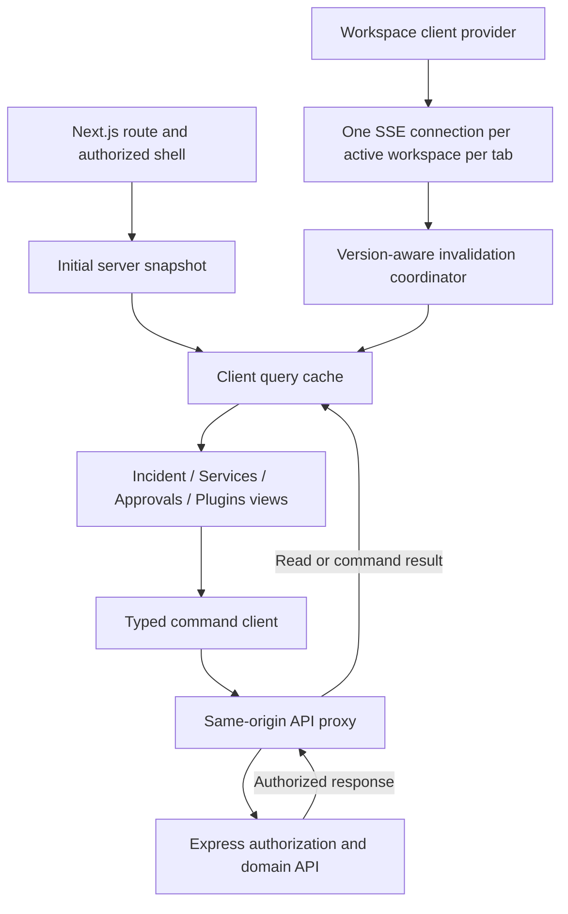
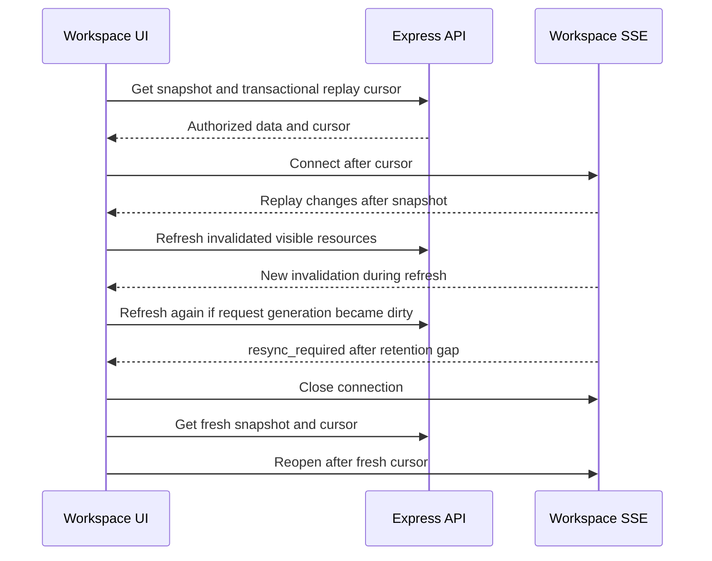

# Frontend Architecture

Status: proposed implementation design, 2026-10-02. Stack: TypeScript, Next.js App Router, React, Tailwind CSS, and accessible Radix-based primitives. This document creates no application files or dependencies. [API contracts](../architecture/API_CONTRACTS.md) define wire formats; [LLD](../architecture/LLD.md) defines server behavior.

## 1. Responsibilities and boundaries

Next.js renders the application shell and initial authorized view. React client components own interactive filters, local drafts, query synchronization, and live updates. All business commands go through the same-origin `/api/v1` proxy to the Express API; the browser never reads MongoDB, Redis, model APIs, object-store credentials, or MCP tools directly.

Next.js defaults layouts/pages to Server Components and uses Client Components for state, handlers, and browser APIs. Keep client boundaries around interactive features instead of marking the entire route tree as client-rendered. [Next.js Server and Client Components](https://nextjs.org/docs/app/getting-started/server-and-client-components).

API responses update the cache through the query client. Server authorization is authoritative even if a UI control is hidden or disabled.

## 2. Proposed source organization

The following paths are a future implementation plan, not files provided by this documentation deliverable.

| Future area | Responsibility | Forbidden dependency |
|---|---|---|
| `apps/web/app/` | Routes, layouts, loading/error boundaries, authorized entry | Direct database clients |
| `apps/web/features/incidents/` | Incident queries, views, mutations, fixture-driven UI states | Plugin execution implementation |
| `apps/web/features/approvals/` | Immutable review presentation and decision flow | Client approval policy as authority |
| `apps/web/features/services/` | Inventory, health, dependencies | Inferring healthy from absent alerts |
| `apps/web/features/plugins/` | Scope/configuration UI and connection state | Provider secrets or arbitrary remote scripts |
| `apps/web/components/ui/` | Tokens and accessible presentation primitives | Workspace business logic |
| `apps/web/lib/api/` | Typed request client, errors, command identity | Raw HTML rendering |
| `apps/web/lib/realtime/` | Bootstrap, stream lifecycle, cursor, invalidation | Event payload treated as permission grant |
| `packages/contracts/` | Shared validated request/response types and event schemas | Server runtime credentials |

Import direction: route → feature → shared UI/API/contracts. Features may use another feature's documented public components, not its internal cache implementation. Plugin-contributed configuration uses an allowlisted schema renderer; plugins do not inject arbitrary React components into the trusted dashboard.

## 3. State ownership and storage

| State | Owner | Persistence and invalidation |
|---|---|---|
| Workspace membership and permissions | Server session/API | Clear client state when revoked; refresh on focus/reconnect |
| Incident, service, approval, plugin entities | Query cache of authorized API responses | In memory; keyed by workspace and ID |
| Search, filters, sort, selected section | URL | Shareable, schema-validated, no secrets; browser Back supported |
| Form values and review acknowledgement | Local component/form state | In memory; reset on spec hash/revision change |
| Pending command identity | Command client | In memory until outcome known; never auto-replay after reload |
| Theme, density, timezone preference | User preference layer | May persist nonsecret preferences locally |
| Stream cursor, connection state, invalidations | Workspace stream provider | Memory only; cleared on workspace/session change |
| Transient menus, dialog state | Local component state | No global persistence |

Select a query library such as TanStack Query at implementation time and pin a tested version. The behavioral contract above is independent of the library. Query keys begin with workspace identity; never reuse an entity key across workspaces even if IDs are globally unique.

## 4. Fetch and cache policy

- User-specific server rendering and API responses use explicit private/no-store handling. Verify the chosen Next.js version's data and route cache behavior; do not rely on a framework default for tenant isolation.
- Public static assets may be cached. Never place authenticated HTML, incident evidence, or credentials into a shared CDN cache.
- Hydrate the client query cache from the authorized server snapshot to avoid fetching the same initial view twice. Discard hydrated data on account/workspace mismatch.
- Revalidate visible incident and approval detail on focus/reconnect. Display the last successful fetch time during background refresh.
- Treat stale times as usability settings, not permission validity. Sensitive decisions always refresh their spec and are validated by the server at submission and dispatch.
- Deduplicate equivalent reads. Abort obsolete search requests; a late response for an earlier filter must not replace the current results.
- Cache key includes filters/sort/page cursor. Lists use server cursor pagination and expose an explicit next-page control.
- Failed background refresh keeps a labeled stale view. Initial fetch failure shows an error state, not an empty list.

Current Next.js guidance describes request-time fetching and streaming through loading boundaries. Choose these behaviors explicitly in implementation. [Next.js fetching data](https://nextjs.org/docs/app/getting-started/fetching-data).

## 5. Durable live-update contract

Canonical endpoints: `GET /api/v1/workspaces/{workspaceId}/dashboard` for bootstrap and `GET /api/v1/workspaces/{workspaceId}/events` for live replay. The dashboard snapshot is read together with its stream watermark in one MongoDB snapshot transaction. Use the opaque `snapshotCursor` as the `after` value; `snapshotStreamSeq` is a decimal string for diagnostics, not client arithmetic. See [API contracts](../architecture/API_CONTRACTS.md).

1. Fetch the authorized dashboard snapshot and associated cursor. Render its freshness immediately.
2. Open same-origin `EventSource` at the workspace events endpoint with `?after={encodedCursor}`. Do not put a session token in the URL.
3. The server honors `Last-Event-ID` on reconnect ahead of the initial `after` parameter. Native EventSource reconnect behavior supplies the last received event ID within the connection lifecycle.
4. Validate event schema and bind each callback to the active workspace/session generation; drop callbacks from a superseded connection after navigation. The server validates cursor/workspace association. Maintain a bounded set of recently seen opaque event IDs to suppress duplicates; repeated invalidation remains safe if an older duplicate falls outside this set. Do not parse or increment cursors. A cursor is not an authorization credential.
5. Minimal events invalidate relevant queries. Coalesce repeated list invalidations for up to 250 ms; action/approval changes invalidate immediately. A new generation of invalidation during a fetch schedules another refresh.
6. On `resync_required`, close the source, clear obsolete pagination cursors, fetch a new authorized bootstrap snapshot, then reopen after its new cursor. Reconcile any dirty queries before declaring current views live.
7. On sign-out/workspace switch/unmount, close the source, cancel pending reads, clear old caches and drafts, then bootstrap the next session/workspace.

Browser EventSource is one-way server-to-client communication. Commands use ordinary authenticated HTTP requests. MDN documents event IDs, named events, and reconnect behavior in [Using server-sent events](https://developer.mozilla.org/en-US/docs/Web/API/Server-sent_events/Using_server-sent_events).

The stream is invalidation transport, not the incident history database. Incident timeline reads use the dedicated timeline endpoint and durable `incident_timeline` records retained for 365 days after resolution; active incidents do not expire by age alone. Workspace replay events last 7 days. An old incident remains readable after its stream events expire.

Maintain one workspace stream per tab, not one per widget. Favor HTTP/2 in deployment; MDN notes low per-origin connection limits for SSE under HTTP/1.1. Cross-tab sharing is optional later optimization and must not broadcast secret data. [MDN EventSource](https://developer.mozilla.org/en-US/docs/Web/API/EventSource).

## 6. Ordering, stale data, and reconnection

Store a monotonically increasing entity version with every cache record. Never overwrite a newer record with an older response. For list queries without entity-level merge certainty, mark dirty and re-fetch instead of guessing insert/remove order. Preserve row focus while showing a pending-update count.

Named `heartbeat` SSE events are expected every 15 seconds; no heartbeat for 45 seconds marks transport delayed. Comment-only keepalives do not reach JavaScript and cannot update this timer. Heartbeats carry no new replay cursor. Network offline marks Offline immediately; browser network hints do not prove the API is reachable. The query freshness timestamp tracks actual successful snapshot reads separately from heartbeat freshness.

Native EventSource hides response details from normal error handlers. If reconnect repeatedly fails, make a normal authenticated bootstrap/session request to distinguish permission/session loss from transient availability. A 401/403 closes the source, clears restricted cached content, and stops reconnect/polling until successful reauthentication or restored authorization. Avoid layering a second reconnect timer on top of a still-open EventSource; close it before any manual restart. Use bounded server retry guidance and jitter in manual recovery, with a visible Retry control.

On restoration, revalidate visible data and permissions before sensitive commands become available. A server-side outage or exhausted reconnect path may temporarily use a 30-second authorized snapshot poll while the page is visible; stop polling when streaming recovers. Do not poll and refresh every widget independently.

## 7. Command contract and concurrency

All state-changing commands use the documented authenticated API, CSRF protection for session cookies, a client-generated UUID `Idempotency-Key`, and `If-Match` for the expected entity version. The server's response/error schema remains canonical.

- Generate command identity once when the user commits an intent. Retries of that same exact request reuse the key and original payload; changed intent gets a new key.
- Never optimistically show approval, incident resolution, plugin revocation, or execution success. Show pending state until the authoritative result arrives.
- `412` means the expected version is stale: refresh, explain what changed, retain safe draft fields, and require a fresh deliberate submit.
- Inspect the structured error code for `409`: `IDEMPOTENCY_CONFLICT` means a reused key with changed content and is a client error; `ACTION_STALE` and `ACTION_EXPIRED` require new preflight/proposal; `INVALID_TRANSITION` requires fresh incident context. Stop automatic submission, retain safe drafts, and show the relevant recovery path.
- A timeout or lost response is not failure proof. Query the current action/command outcome; do not create a second request identity or blindly repeat an external action.
- Disable duplicate submit while pending, but preserve a visible label and status. Navigation away must not fabricate cancellation.
- Confirmation state binds to action ID, immutable spec hash, target revision, remediation revision, and expiry. Any change clears the acknowledgement and blocks stale approval. A renewed action displays original and renewal requester, requires fresh review, and cannot inherit the previous approval.
- The UI can display permitted operations from the server; server authorization and dispatch policy remain authoritative.

## 8. Security and content handling

HttpOnly server-session cookies authenticate requests. Browser code holds no provider keys, database strings, tool credentials, or approval-signing material. Do not serialize secrets through Server Component props or public environment variables.

Render AI, plugin, log, and runbook content as untrusted data. Use a strict sanitized Markdown renderer with no raw HTML, scriptable URL schemes, embedded iframes, or remote execution. Redacted evidence downloads use authorized short-lived access and a clear filename. Do not add telemetry containing raw prompts, log bodies, tokens, or command arguments with secrets.

Server-controlled integration schemas have size/depth limits. Configuration previews cannot fetch arbitrary external URLs in the browser. Production target selection uses authoritative identifiers from the service inventory, not unchecked AI text.

## 9. Performance, testability, and release gates

Initial usable dashboard target is under 2.5 seconds on a representative mid-tier mobile device over 4G. This is a proposed target and needs measured device/network definitions. Ship the incident summary and connection state before optional charts or evidence previews; lazy-load heavy chart/editor modules by route or interaction.

| Concern | Required verification |
|---|---|
| Stream race | A change between snapshot and connection appears through replay; no stale overwrite during concurrent fetch |
| Resync | Cursor older than 7 days produces full refresh with retained durable incident history |
| Command retry | Lost response and double click do not create duplicate logical approvals/actions |
| Role change | Open review loses ability to submit and restricted caches are cleared |
| Concurrent plan edit | Old review acknowledgement invalidates and `412` is handled clearly |
| Responsive UI | Breakpoint edges, keyboard, touch, zoom, long content; see [Responsive rules](RESPONSIVE_RULES.md) |
| Accessibility | Manual complete workflows and automated component checks; see [Accessibility](ACCESSIBILITY.md) |
| Dependency failure | Incident work continues when AI/chart/evidence subpanel fails |

Use deterministic fixtures for all domain and connection states. Avoid asserting only snapshots of markup; test operator outcomes and API/event boundaries. Record real performance and accessibility results before declaring these targets achieved.
