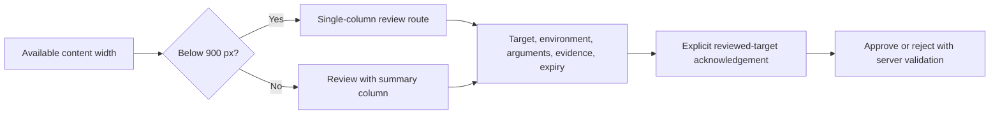

# Responsive Layout and Interaction Rules

Status: proposed frontend contract, 2026-10-02. Layout depends on available CSS width and input capability, never a device-name or user-agent guess. Applies to every route, plugin settings form, error page, and approval flow.

## 1. Breakpoint contract

Use mobile-first minimum-width queries. These application breakpoints are explicit project choices; configure the styling framework to these names instead of assuming a preset.

| Tier | CSS viewport width | Outer gutter | Navigation | Content grid |
|---|---|---|---|---|
| Compact | 320–639 px | 16 px | 56 px header, menu button; no persistent sidebar | 1 column; optional 2 metric cells if each stays >=136 px |
| Large compact | 640–767 px | 20 px | Same header/menu | 2 summary columns, 1 investigation column |
| Tablet | 768–1023 px | 24 px | 72 px icon rail with named tooltips; full menu on request | 8 columns, 16 px gap |
| Desktop | 1024–1439 px | 24 px | 240 px labeled sidebar, optionally collapsed to 72 px | 12 columns, 24 px gap |
| Wide | >=1440 px | 32 px | 240 px labeled sidebar | 12 columns, 24 px gap, content max-width 1680 px |

The minimum supported layout target is 320 CSS px, including the effective viewport at high zoom. Widths below 320 must still keep text and controls reachable through normal document flow. Do not set a global `min-width` on the page. At 1024 px with a sidebar, incident detail stays one column until its actual content container is >=1000 px wide.

The tablet rail uses the same permission-filtered destination order as the full sidebar. Every icon has an accessible name and a visible label on keyboard focus/hover; a permanently available “Menu” button opens the full named navigation for touch users. Never require a long press or icon recognition to discover a destination. A user preference may expand the rail into an overlay without changing the route.

Use container queries for reusable cards, approval summaries, and split detail panels. A viewport breakpoint does not guarantee that a component has enough width inside a sidebar layout. Text uses rem; layout widths may use px or rem conversions with the same effective thresholds.

## 2. Component behavior matrix

| Component | Compact / large compact | Tablet | Desktop / wide |
|---|---|---|---|
| Page heading | Title wraps, actions beneath | Title + secondary action if it fits | Title and actions in one row if content fits |
| Header search | Labeled search button opens full-width search | Search button or inline field >=240 px | Inline field, max 480 px |
| Metrics | 1–2 columns, each label wraps | 2 columns | 4 columns |
| Incidents | Semantic list of cards | Reduced-column table if container >=680 px; otherwise cards | Full table |
| Filters | “Filters (n)” opens full-screen dialog; applied chips remain visible | Wrapping row plus more-filters panel | Wrapping row; advanced filters disclosure |
| Incident detail | Summary, activity, evidence, plans in natural order | Same or route-based sections | Main + context only with sufficient container width |
| Approval review | Full route, one column; decision after detail | Full route; side context only if >=900 px container | Main review + fixed-width summary, DOM order preserved |
| Timeline | Time and actor wrap above content | Aligned time gutter if it fits | 96 px time gutter plus content |
| Service grid | 1 column | 2 columns | 3 columns, up to 4 on wide |
| Plugin grid | 1 column; capability lists wrap | 2 columns | 3 columns |
| Charts | Height >=220 px; 3–4 time ticks; legend below | Height >=260 px | Height 280–360 px; denser ticks if labels fit |
| Dialog | Full-screen above browser chrome; close visible | Max 640 px, 24 px edge clearance | Max 640 px; complex task uses route |
| Evidence drawer | Dedicated evidence view with Back link | Max 80vw; one active overlay | 480–640 px drawer |
| Toast region | Above safe-area bottom; does not cover action controls | Bottom-end, max 360 px | Bottom-end, max 400 px |

Never reduce text size to squeeze a desktop layout onto a phone. Wrap, stack, disclose secondary information, or provide a focused detail route. Required safety fields remain visible in all approval layouts.

## 3. Narrow incident card contract

Each card has one heading link to incident detail; controls are siblings, not nested interactive elements.

1. Severity badge + lifecycle state, with full textual labels.
2. Incident title, allowed to wrap to at least three lines before optional expansion.
3. Service name and explicit environment label.
4. Owner or “Unassigned,” then latest update time.
5. Acknowledge button if permitted, otherwise “View incident.”

Cards retain the list's sort order, filter meaning, any server-provided total count, and pagination. If only a page count is known, say “25 items shown.” Secondary table fields are available on detail, not silently lost. Avoid rendering an active table and active card list simultaneously; if both exist for responsive composition, exactly one is exposed and its focus is preserved when the mode changes.

## 4. Dense tables and large datasets

- Default desktop row minimum is 48 px; optional compact density uses 40 px only for fine-pointer contexts and keeps interactive targets at least 32 px with spacing. Coarse-pointer rows use >=48 px.
- Table cells allow vertical growth. Never lock row height when content wraps, text spacing increases, or the browser enlarges text.
- Keep incident title and environment visible. Reduce secondary columns in the order: age, updated-by detail, secondary owner metadata. Severity, state, title, and environment never disappear without equivalent content.
- Use a named, locally scrollable wrapper for genuinely two-dimensional tables, such as audit comparisons. Show a visible scroll cue and preserve keyboard access. The page itself must not acquire horizontal overflow.
- Avoid sticky first columns on narrow screens when they leave insufficient room to read the remaining content. Sticky headers must not obscure focus.
- Default page size is 25; support 50 on desktop where needed. Use server cursor pagination and accurate “Showing 25 items” text rather than inventing a total if the API omits one.
- Do not virtualize the first implementation. If measured data volume justifies virtualization later, test screen-reader row context, keyboard navigation, focus retention, and a nonvirtualized alternative.
- Sorting is a button in a header with current sort announced. Do not make every cell a tab stop; use the native table pattern in [Accessibility](ACCESSIBILITY.md).

## 5. Approval and form safety across widths

On compact layouts, action buttons stack with 12 px separation and a minimum 44 px height. The primary approval button includes the operation and environment in its label; it can wrap to two lines. “Reject” is visually distinct and never adjacent to an icon-only approval control.

At any width, a sticky action region must reserve its own space, respect bottom safe-area insets, and not obscure the last form field or its error. If the on-screen keyboard reduces usable height below 480 px, use normal-flow controls instead of a sticky footer. Keep the focused field visible with measured scroll padding.

Forms are single column until the container is >=720 px. Only tightly related short fields may share a row. Long service names, tool arguments, secret instructions, and errors always receive full width. Validation messages appear immediately after their field and in the submission error summary.

Changing viewport width or orientation must not reset entered values, selected filters, approval identity, or scroll position unnecessarily. A resizing review continues to refer to the same immutable action spec.

## 6. Touch, keyboard, and pointer

Project target: primary mobile controls and icon buttons provide at least 44×44 CSS px interactive area. This exceeds the WCAG 2.2 AA minimum target criterion of 24×24 CSS px, which has documented exceptions. See [W3C target size guidance](https://www.w3.org/WAI/WCAG22/Understanding/target-size-minimum.html).

- Use 8 px minimum visual separation between independent compact controls where possible; do not make invisible target boxes overlap.
- Trigger actions on normal click/up activation, so moving away before release can cancel. Never execute on pointer-down.
- Hover is an enhancement. Tooltips, timestamps, chart data, and overflow actions remain available through keyboard and tap.
- Swipe may supplement timeline navigation, but every action has a visible button. Dragging has move-up/move-down or equivalent button alternatives.
- Do not infer that a wide screen has a mouse. Combine width with `pointer: coarse` and `hover: none` for touch sizing, while retaining keyboard support.
- Prevent accidental double submission by tracking command identity and pending state; pointer debouncing alone is insufficient.

## 7. Zoom, viewport, and overflow

Use a normal device-width viewport and allow user scaling. Verify 200% text enlargement and reflow at 320 CSS px (commonly tested with a 1280 px viewport at 400% zoom). Ordinary reading and controls must not need two-axis scrolling; truly two-dimensional data regions may use the documented exception. [W3C reflow guidance](https://www.w3.org/WAI/WCAG22/Understanding/reflow.html).

Use `min-width: 0` on grid/flex children, wrapping for long IDs, and bounded local overflow for code and raw evidence. Avoid fixed heights on text containers. Navigation and dialog heights use dynamic viewport sizing with fallback; safe-area padding protects content around display cutouts.

Landscape phones follow available width, but short height disables unnecessary sticky elements. Sticky headers reserve scroll margin for anchored headings. Never lock a user to portrait or landscape. At 200% text size, collapse the sidebar earlier if content no longer fits.

## 8. Live data, offline, and reduced bandwidth

- Connection state is always visible as text: Live, Reconnecting, Updates delayed, or Offline. Show last successful snapshot time independently of transport heartbeat time.
- After 45 seconds without the named `heartbeat` stream event expected every 15 seconds, mark the transport delayed. A heartbeat proves connectivity, not fresh underlying metrics.
- Offline mode retains only already loaded in-memory views; commands remain disabled. Do not store evidence, bearer tokens, or approval drafts in persistent browser storage.
- When a tab returns to the foreground or network returns, revalidate permissions and current visible data before enabling sensitive commands.
- Under limited bandwidth, fetch summaries first and load evidence or chart details on demand. Do not download all runbook artifacts or all historical events for the overview.
- A paused timeline says “Display paused” while still processing connection health; resuming exposes the number of accumulated updates.

## 9. Verification matrix

| Test | Required cases | Pass condition |
|---|---|---|
| Width boundaries | 320, 375, 639, 640, 767, 768, 1023, 1024, 1439, 1440, 1920 px | No unexpected overflow or unreachable controls |
| Height and orientation | 375×667, 667×375, 768×1024, 1024×768 | Dialog close, active input, and decision controls remain reachable |
| Zoom and text | 200% text; 400% browser zoom at 1280 px; custom spacing | No clipped labels or hidden required fields |
| Input | Touch, mouse, keyboard, screen reader | Same essential tasks available |
| Content stress | 120-character service name, long ID, 20 filters, 5-line error | Layout grows without overlapping controls |
| Network | Offline, 5-second API latency, stream disconnect, late replay | Honest status and no duplicate command |
| Theme | Light, dark, forced colors, reduced motion | Meaning and focus remain visible |

Capture viewport screenshots and interaction results for the above cases during implementation. These are acceptance criteria, not a claim of completed browser testing.
