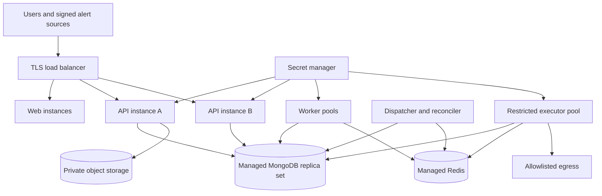

# Deployment and environment design

[Home](../../README.md) • Proposed implementation and release procedure

## 1. Environments

| Environment | Data | Connectors | Purpose |
| --- | --- | --- | --- |
| Local | Seeded synthetic tenants | Simulator, fixture model, local runbooks | Repeatable development without paid services |
| CI | Disposable synthetic data | Deterministic fakes and fault injection | Tests and contract checks |
| Staging | Synthetic/anonymized approved fixtures | Provider sandboxes and read-only test integrations | Full release rehearsal |
| Production pilot | Authorized tenant data | Reviewed integrations with narrow grants | Limited real usage after readiness gates |

Separate credentials, databases, queues, buckets and OIDC client registrations per environment. Demo mode is a server-side policy boundary; changing a browser label or query parameter cannot enable production actions.

## 2. Local topology

Future Compose definition should start `web`, `api`, `worker`, `executor`, MongoDB configured as a single-node replica set, Redis, an S3-compatible local store and the simulator. A development OIDC provider or a test-only authentication adapter must be explicitly disabled outside local/CI. The app fails startup if test auth is selected in production.

A single-node replica set enables transaction development but provides no high availability. Readiness waits for replica-set initiation and index migrations, not merely an open TCP port. Seed script creates at least two workspaces to expose accidental unscoped queries.

### Proposed startup order

1. Start backing services and initialize the replica set.
2. Apply additive collection/index migrations.
3. Seed synthetic data and local connector grants.
4. Start API/worker/executor, then web and proxy.
5. Verify health, login, alert receipt and one simulator investigation.

Exact commands will be defined in the future package scripts; no commands in this package imply that the application already exists.

## 3. Production topology

Use a regional container platform with at least two API instances across failure domains, managed MongoDB replica set, managed Redis with persistence/replication, object storage with versioning and a secret manager. The selected cloud is intentionally left open; map these responsibilities to a provider when provisioning begins.

Investigation and action workers have separate workload identities. An investigator can read approved evidence but cannot fetch production action credentials. Use application-level grant checks in addition to infrastructure egress rules.

## 4. Configuration inventory

Suggested names are placeholders for future implementation; secret values must never enter Markdown or the repository.

| Setting | Secret? | Validation |
| --- | --- | --- |
| APP_ENV | No | local/ci/staging/production |
| PUBLIC_APP_ORIGIN | No | Canonical HTTPS origin outside local |
| MONGODB_URI | Yes | Replica-set connection; TLS and least-privilege account |
| REDIS_URL | Yes | TLS in hosted environments; separate app environment |
| OBJECT_STORAGE_ENDPOINT / BUCKET | Sometimes | Approved region and private bucket |
| OIDC_ISSUER / CLIENT_ID | No | Fixed issuer and registered callback |
| OIDC_CLIENT_SECRET | Yes | Server-only identity secret |
| SESSION_SECRET_REF / CURSOR_SIGNING_KEY_REF | Yes | Rotatable key reference, not hard-coded key |
| MODEL_PROVIDER_PROFILE | No | Qualified provider/model profile ID |
| MODEL_API_KEY_REF | Yes | Secret-manager reference |
| LANGSMITH_ENABLED | No | Default false until data-sharing configuration is reviewed |
| OTEL_EXPORTER_ENDPOINT | Sometimes | Approved endpoint; no secret-bearing URL in logs |
| ACTIONS_ENABLED | No | false by default; cannot override per-workspace policy |
| MAX_AI_CONCURRENCY / WORKSPACE_AI_BUDGET | No | Positive bounds and admission policy |

Validate all required configuration at startup. Reject partial production configuration with an actionable error. Do not silently fall back to fixture authentication, simulator credentials or another AI provider.

## 5. Health and graceful shutdown

- `/health/live`: process can handle requests; no slow dependency calls.
- `/health/ready`: API can reach authoritative database and has required schema/config. Redis/model outages expose degraded components but need not remove a DB-capable API from service.
- Worker readiness: database reachable, queue connection available for that worker, supported job schema loaded.
- Executor readiness: policy store and action credential access healthy; fail closed on missing checks.

On shutdown: stop accepting new work; drain HTTP requests; close SSE with reconnect semantics; stop claiming jobs; checkpoint bounded read jobs; renew leases only during a bounded shutdown window. A dispatched action without a conclusive receipt must be reconciled by the replacement worker. Do not label every interrupted action failed.

## 6. Proxy and browser transport

Route `/api/v1/*` to Express. Disable response buffering/caching for SSE. Send heartbeat events every 15 seconds and set intermediary read timeout to at least 60 seconds. Test the complete hosted chain, including any CDN. Use HTTP/2 when supported; avoid opening a connection per dashboard widget.

Configure strict origin handling, content security policy, secure cookies, allowed upload sizes and appropriate HSTS after domain validation. A long-lived stream must not keep a revoked session valid indefinitely. Rotate cursor signing keys with an overlap period so retained cursors can still be verified or explicitly resynchronized.

## 7. CI/CD and release sequence

1. Run applicable static, unit, integration, security and UI checks.
2. Build reproducible containers from a lockfile; record image digest and SBOM.
3. Scan dependencies/images and review material unresolved findings.
4. Apply additive migrations in staging; test mixed old/new readers.
5. Deploy staging with provider sandboxes; replay the acceptance scenario.
6. Promote the same image digest to production pilot.
7. Apply compatible indexes/migrations before code that needs them.
8. Deploy API and workers gradually with readiness/drain handling.
9. Observe core request failures, queue age, action outcomes and browser errors.
10. Enable new connector capabilities separately through an explicit grant/config change.

Keep a compatibility matrix of application version, event/job schema and database migration version. Workers must reject unsupported job versions to a visible failed state, not deserialize them optimistically.

## 8. Backup and restoration

Proposed production policy: continuous database backup where supported with recovery point <=5 minutes, daily snapshot, 35-day backup retention; object storage versioning with matching retention controls; secret-manager backup/recovery through the selected provider. Redis is recoverable scheduling state and must not be the only record of accepted work.

Monthly restoration rehearsal: restore into an isolated environment; apply deletion/revocation tombstones; validate workspace isolation, counts and checksums; rebuild derived indexes; reconstruct unfinished jobs from outbox; reconcile all actions that were executing at recovery time. Do not contact real providers until a human verifies restored grants and execution outcomes.

Recovery targets are RPO <=5 minutes and RTO <=60 minutes for a regional incident. Record actual timings and revise capacity/backup plans if targets fail. Never assert that a restored database can determine all external action effects by itself.

## 9. Rollback

Application rollback uses a previous compatible image. Pause new action dispatch while investigating a release that affects policy or execution. Preserve evidence, request IDs and outbox state. Database migrations follow expand/contract so routine rollback needs no data destruction. A completed infrastructure action is reverted only through a new reviewed action, not by rolling back the dashboard deployment.

## 10. Cost controls

Estimate total monthly cost as container runtime + database/storage/indexes/backups + queue + object storage/egress + model input/output tokens + observability retention. Record units and current provider prices at procurement time; this design does not invent a fixed monthly bill.

Limit duplicate investigation, cap evidence and context tokens, cache versioned runbook embeddings, sample low-value traces and retain debug payloads briefly. Budget notifications do not silently downgrade correctness or move data to an unapproved provider.
